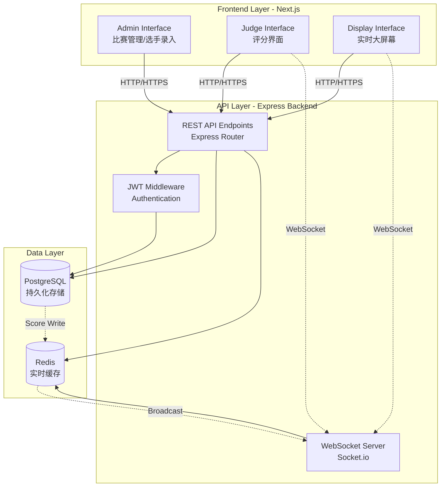
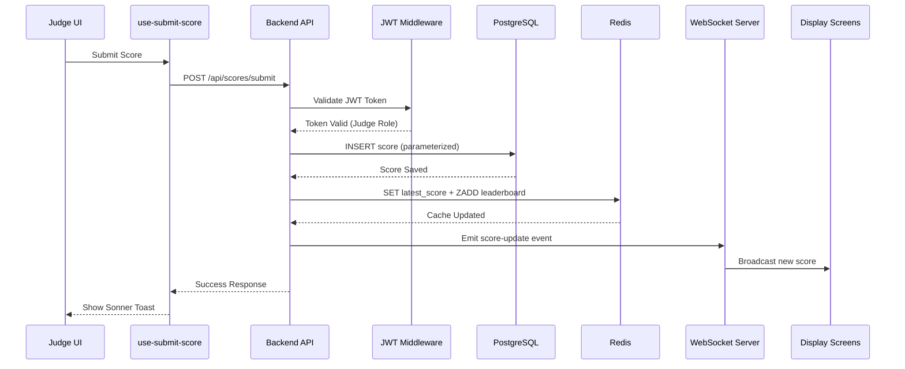
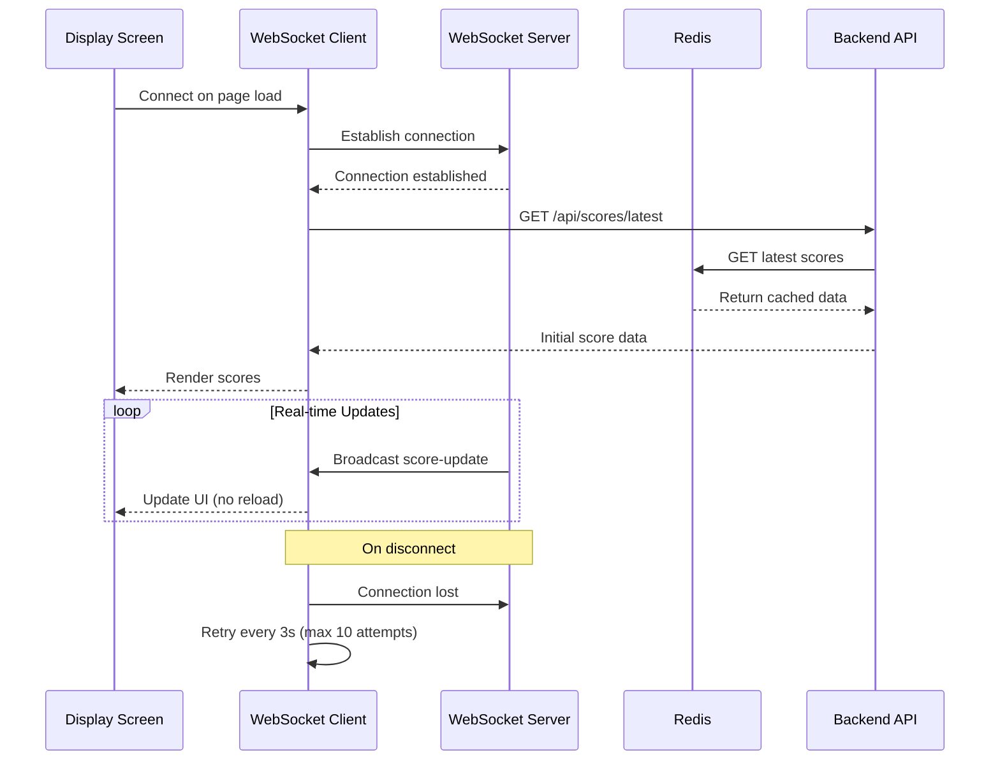
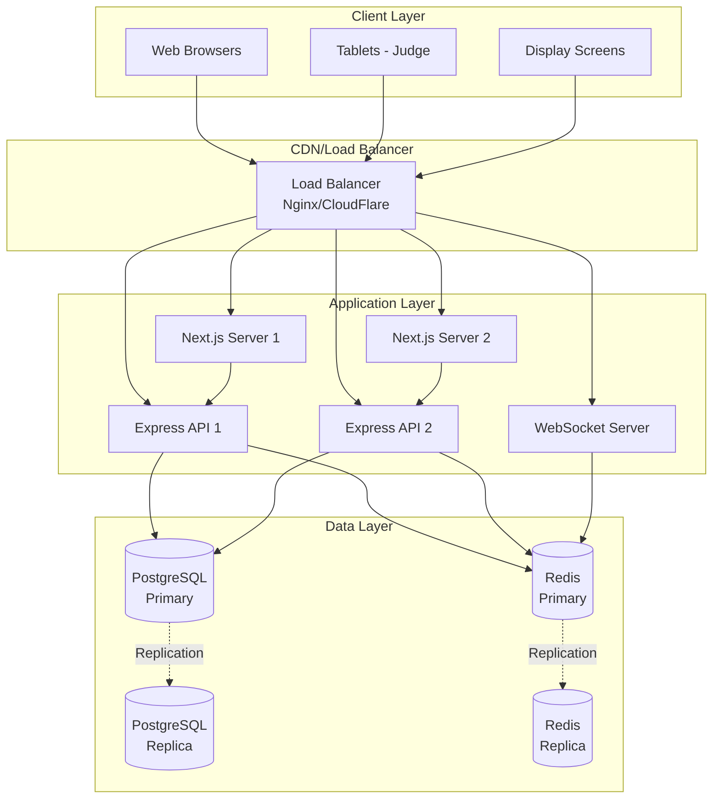

# Design Document: Realtime Scoring System

## Overview

The Realtime Scoring System is a full-stack web application designed to manage competitive scoring events with real-time score broadcasting capabilities. The system serves three distinct user roles (Admin, Judge, Display) and supports three competition types (Individual Stage, Duo/Team Stage, Challenge) with different scoring dimensions.

### Key Features

- **Multi-role Architecture**: Separate interfaces for Admin, Judge, and Display roles
- **Real-time Score Broadcasting**: WebSocket-based live score updates to display screens
- **Three Competition Types**: Individual Stage (5 dimensions), Duo/Team (5 dimensions), Challenge (3 dimensions)
- **Regional Competition Support**: Organize and filter competitions by geographical regions
- **Responsive Design**: Optimized for tablets (Judge interface) and large displays (Scoreboard)
- **Theme Support**: Light mode for Judge/Admin, Dark mode for Display screens

### Technology Stack

**Frontend:**
- Next.js 16.2.3 (React 19.2.4) with App Router
- TypeScript 5.x
- Tailwind CSS 4.x
- SWR for data fetching and caching
- Socket.io-client for WebSocket connections
- Sonner for toast notifications

**Backend:**
- Node.js with Express 5.2.1
- PostgreSQL 8.20.0 (primary database)
- Redis (ioredis 5.10.1) for caching and real-time data
- Socket.io 4.8.3 for WebSocket server
- JWT for authentication

### Architecture Principles

1. **Strict Frontend-Backend Separation**: Frontend never directly accesses database or cache
2. **API-First Design**: All data operations go through REST API endpoints
3. **Real-time Data Flow**: PostgreSQL → Redis → WebSocket → Display clients
4. **Security by Design**: JWT authentication, parameterized queries, role-based access control
5. **Performance Optimization**: Redis caching, connection pooling, skeleton loading states


## Architecture

### System Architecture Diagram



### Data Flow Architecture

#### Score Submission Flow



#### Real-time Display Flow



### Component Architecture

#### Frontend Component Hierarchy

```
app/
├── [locale]/
│   ├── (admin)/                    # Admin role group
│   │   ├── layout.tsx              # Admin layout with nav
│   │   ├── dashboard/
│   │   │   ├── page.tsx            # Admin dashboard
│   │   │   └── loading.tsx         # Skeleton screen
│   │   ├── competitions/
│   │   │   ├── page.tsx            # Competition management
│   │   │   ├── loading.tsx
│   │   │   └── [id]/
│   │   │       └── page.tsx        # Edit competition
│   │   └── athletes/
│   │       ├── page.tsx            # Athlete management
│   │       └── loading.tsx
│   │
│   ├── (judge)/                    # Judge role group
│   │   ├── layout.tsx              # Judge layout
│   │   ├── dashboard/
│   │   │   ├── page.tsx            # Judge dashboard
│   │   │   └── loading.tsx
│   │   ├── select-competition/
│   │   │   ├── page.tsx            # Competition selection
│   │   │   └── loading.tsx
│   │   └── scoring/
│   │       ├── page.tsx            # Scoring interface
│   │       └── loading.tsx
│   │
│   ├── (display)/                  # Display role group
│   │   ├── layout.tsx              # Display layout (dark theme)
│   │   ├── scoreboard/
│   │   │   ├── page.tsx            # Real-time scoreboard
│   │   │   └── loading.tsx
│   │   └── rankings/
│   │       ├── page.tsx            # Rankings display
│   │       └── loading.tsx
│   │
│   └── (auth)/                     # Authentication group
│       ├── layout.tsx              # Auth layout
│       ├── sign-in/
│       │   ├── page.tsx
│       │   └── loading.tsx
│       └── sign-up/
│           ├── page.tsx
│           └── loading.tsx
│
components/
├── admin/
│   ├── competition-form.tsx        # Create/edit competition
│   ├── athlete-form.tsx            # Add/edit athlete
│   └── competition-athlete-list.tsx
│
├── judge/
│   ├── competition-selector.tsx    # Select competition to score
│   ├── score-input-form.tsx        # Dynamic scoring form
│   └── athlete-card.tsx            # Athlete info display
│
├── display/
│   ├── scoreboard-grid.tsx         # Score display grid
│   ├── ranking-table.tsx           # Rankings table
│   └── score-animation.tsx         # Score update animation
│
├── auth/
│   └── auth-form.tsx               # Login/register form
│
└── shared/
    ├── theme-toggle.tsx            # Light/dark theme switch
    ├── loading-skeleton.tsx        # Reusable skeleton
    └── error-boundary.tsx          # Error handling
```

### Backend Architecture

#### API Structure

```
backend/
├── index.js                        # Express app entry point
├── db.js                           # PostgreSQL connection pool
├── socket.js                       # WebSocket server setup
├── .env                            # Environment variables
│
├── middleware/
│   ├── auth.js                     # JWT validation middleware
│   ├── error-handler.js            # Global error handler
│   └── validate.js                 # Request validation
│
├── routes/
│   ├── auth.routes.js              # POST /api/auth/login, /register
│   ├── competitions.routes.js      # CRUD for competitions
│   ├── athletes.routes.js          # CRUD for athletes
│   ├── scores.routes.js            # Score submission and retrieval
│   └── display.routes.js           # Display-specific endpoints
│
├── controllers/
│   ├── auth.controller.js          # Authentication logic
│   ├── competitions.controller.js  # Competition management
│   ├── athletes.controller.js      # Athlete management
│   └── scores.controller.js        # Score processing
│
├── services/
│   ├── db.service.js               # Database query helpers
│   ├── redis.service.js            # Redis operations
│   └── websocket.service.js        # WebSocket broadcast logic
│
└── utils/
    ├── jwt.util.js                 # JWT generation/validation
    ├── validation.util.js          # Input validation helpers
    └── constants.js                # Competition types, roles, etc.
```


## Data Models

### Database Schema (PostgreSQL)

#### users Table

```sql
CREATE TABLE users (
    id SERIAL PRIMARY KEY,
    username VARCHAR(50) UNIQUE NOT NULL,
    email VARCHAR(100) UNIQUE NOT NULL,
    password_hash VARCHAR(255) NOT NULL,
    role VARCHAR(20) NOT NULL CHECK (role IN ('admin', 'judge')),
    created_at TIMESTAMP DEFAULT CURRENT_TIMESTAMP,
    updated_at TIMESTAMP DEFAULT CURRENT_TIMESTAMP
);

CREATE INDEX idx_users_email ON users(email);
CREATE INDEX idx_users_role ON users(role);
```

**Fields:**
- `id`: Primary key, auto-increment
- `username`: Unique username for login
- `email`: Unique email address
- `password_hash`: Bcrypt hashed password
- `role`: User role (admin or judge)
- `created_at`: Account creation timestamp
- `updated_at`: Last update timestamp

#### competitions Table

```sql
CREATE TABLE competitions (
    id SERIAL PRIMARY KEY,
    name VARCHAR(100) NOT NULL,
    competition_type VARCHAR(20) NOT NULL CHECK (
        competition_type IN ('individual', 'duo_team', 'challenge')
    ),
    region VARCHAR(50) NOT NULL,
    status VARCHAR(20) DEFAULT 'upcoming' CHECK (
        status IN ('upcoming', 'active', 'completed')
    ),
    start_date TIMESTAMP,
    end_date TIMESTAMP,
    created_by INTEGER REFERENCES users(id),
    created_at TIMESTAMP DEFAULT CURRENT_TIMESTAMP,
    updated_at TIMESTAMP DEFAULT CURRENT_TIMESTAMP
);

CREATE INDEX idx_competitions_type ON competitions(competition_type);
CREATE INDEX idx_competitions_region ON competitions(region);
CREATE INDEX idx_competitions_status ON competitions(status);
```

**Fields:**
- `id`: Primary key
- `name`: Competition name (e.g., "2024春季个人赛")
- `competition_type`: Type of competition (individual, duo_team, challenge)
- `region`: Regional division (e.g., "华东赛区", "华北赛区")
- `status`: Competition status (upcoming, active, completed)
- `start_date`: Competition start time
- `end_date`: Competition end time
- `created_by`: Admin user who created the competition
- `created_at`: Record creation timestamp
- `updated_at`: Last update timestamp

#### athletes Table

```sql
CREATE TABLE athletes (
    id SERIAL PRIMARY KEY,
    name VARCHAR(100) NOT NULL,
    athlete_number VARCHAR(20) UNIQUE,
    team_name VARCHAR(100),
    contact_email VARCHAR(100),
    contact_phone VARCHAR(20),
    created_at TIMESTAMP DEFAULT CURRENT_TIMESTAMP,
    updated_at TIMESTAMP DEFAULT CURRENT_TIMESTAMP
);

CREATE INDEX idx_athletes_number ON athletes(athlete_number);
CREATE INDEX idx_athletes_name ON athletes(name);
```

**Fields:**
- `id`: Primary key
- `name`: Athlete name or team name
- `athlete_number`: Unique athlete/team number
- `team_name`: Team name (for duo/team competitions)
- `contact_email`: Contact email
- `contact_phone`: Contact phone number
- `created_at`: Record creation timestamp
- `updated_at`: Last update timestamp

#### competition_athletes Table (Many-to-Many)

```sql
CREATE TABLE competition_athletes (
    id SERIAL PRIMARY KEY,
    competition_id INTEGER NOT NULL REFERENCES competitions(id) ON DELETE CASCADE,
    athlete_id INTEGER NOT NULL REFERENCES athletes(id) ON DELETE CASCADE,
    registration_date TIMESTAMP DEFAULT CURRENT_TIMESTAMP,
    UNIQUE(competition_id, athlete_id)
);

CREATE INDEX idx_comp_athletes_comp ON competition_athletes(competition_id);
CREATE INDEX idx_comp_athletes_athlete ON competition_athletes(athlete_id);
```

**Fields:**
- `id`: Primary key
- `competition_id`: Foreign key to competitions
- `athlete_id`: Foreign key to athletes
- `registration_date`: Registration timestamp
- **Constraint**: Unique combination of competition_id and athlete_id

#### scores Table

```sql
CREATE TABLE scores (
    id SERIAL PRIMARY KEY,
    competition_id INTEGER NOT NULL REFERENCES competitions(id) ON DELETE CASCADE,
    athlete_id INTEGER NOT NULL REFERENCES athletes(id) ON DELETE CASCADE,
    judge_id INTEGER NOT NULL REFERENCES users(id),
    
    -- Individual Stage & Duo/Team dimensions
    action_difficulty DECIMAL(5,2),
    stage_artistry DECIMAL(5,2),
    action_creativity DECIMAL(5,2),
    action_fluency DECIMAL(5,2),
    costume_styling DECIMAL(5,2),
    
    -- Duo/Team specific dimension
    action_interaction DECIMAL(5,2),
    
    -- Metadata
    submitted_at TIMESTAMP DEFAULT CURRENT_TIMESTAMP,
    
    CONSTRAINT unique_judge_athlete_score UNIQUE(competition_id, athlete_id, judge_id)
);

CREATE INDEX idx_scores_competition ON scores(competition_id);
CREATE INDEX idx_scores_athlete ON scores(athlete_id);
CREATE INDEX idx_scores_judge ON scores(judge_id);
CREATE INDEX idx_scores_submitted ON scores(submitted_at DESC);
```

**Fields:**
- `id`: Primary key
- `competition_id`: Foreign key to competitions
- `athlete_id`: Foreign key to athletes
- `judge_id`: Foreign key to users (judge)
- **Score Dimensions:**
  - `action_difficulty`: Difficulty score (all types)
  - `stage_artistry`: Artistry score (individual, duo_team)
  - `action_creativity`: Creativity score (all types)
  - `action_fluency`: Fluency score (individual, challenge)
  - `costume_styling`: Costume score (individual, duo_team)
  - `action_interaction`: Interaction score (duo_team only)
- `submitted_at`: Score submission timestamp
- **Constraint**: One score per judge per athlete per competition

### Redis Data Structures

#### Latest Score Cache

```
Key: latest_score:competition:{competition_id}
Type: String (JSON)
TTL: 3600 seconds (1 hour)
Value: {
    "competition_id": 1,
    "athlete_id": 5,
    "athlete_name": "张三",
    "judge_id": 3,
    "judge_name": "评委A",
    "scores": {
        "action_difficulty": 28.5,
        "stage_artistry": 22.0,
        "action_creativity": 15.5,
        "action_fluency": 18.0,
        "costume_styling": 8.5
    },
    "competition_type": "individual",
    "timestamp": "2024-01-15T10:30:45Z"
}
```

#### Leaderboard (Sorted Set)

```
Key: leaderboard:competition:{competition_id}
Type: Sorted Set (ZSET)
TTL: 7200 seconds (2 hours)
Members: athlete_id:{athlete_id}
Scores: Average total score (calculated from all judges)

Example:
ZADD leaderboard:competition:1 85.5 "athlete_id:5"
ZADD leaderboard:competition:1 82.3 "athlete_id:3"
ZADD leaderboard:competition:1 79.8 "athlete_id:7"

ZREVRANGE leaderboard:competition:1 0 9 WITHSCORES  # Top 10
```

#### Active Competitions Set

```
Key: active_competitions
Type: Set
TTL: None (persistent)
Members: competition_id values

SADD active_competitions 1 2 3
SMEMBERS active_competitions  # Get all active competition IDs
```

#### WebSocket Connection Tracking

```
Key: ws_connections:competition:{competition_id}
Type: Set
TTL: 3600 seconds
Members: socket_id values

SADD ws_connections:competition:1 "socket_abc123"
SCARD ws_connections:competition:1  # Count connected clients
```


## Components and Interfaces

### Frontend TypeScript Interfaces

#### Core Entity Interfaces

```typescript
// interface/user.ts
export interface User {
  id: number;
  username: string;
  email: string;
  role: 'admin' | 'judge';
  created_at: string;
}

export interface AuthResponse {
  success: boolean;
  token: string;
  user: User;
  message?: string;
}

export interface LoginRequest {
  email: string;
  password: string;
}

export interface RegisterRequest {
  username: string;
  email: string;
  password: string;
  role: 'admin' | 'judge';
}
```

```typescript
// interface/competition.ts
export type CompetitionType = 'individual' | 'duo_team' | 'challenge';
export type CompetitionStatus = 'upcoming' | 'active' | 'completed';

export interface Competition {
  id: number;
  name: string;
  competition_type: CompetitionType;
  region: string;
  status: CompetitionStatus;
  start_date: string;
  end_date: string;
  created_by: number;
  created_at: string;
  updated_at: string;
}

export interface CreateCompetitionRequest {
  name: string;
  competition_type: CompetitionType;
  region: string;
  start_date: string;
  end_date: string;
}

export interface CompetitionWithAthletes extends Competition {
  athletes: Athlete[];
  athlete_count: number;
}
```

```typescript
// interface/athlete.ts
export interface Athlete {
  id: number;
  name: string;
  athlete_number: string;
  team_name?: string;
  contact_email?: string;
  contact_phone?: string;
  created_at: string;
  updated_at: string;
}

export interface CreateAthleteRequest {
  name: string;
  athlete_number: string;
  team_name?: string;
  contact_email?: string;
  contact_phone?: string;
}

export interface AthleteWithCompetitions extends Athlete {
  competitions: Competition[];
}
```

```typescript
// interface/score.ts
export interface IndividualScores {
  action_difficulty: number;
  stage_artistry: number;
  action_creativity: number;
  action_fluency: number;
  costume_styling: number;
}

export interface DuoTeamScores {
  action_difficulty: number;
  stage_artistry: number;
  action_interaction: number;
  action_creativity: number;
  costume_styling: number;
}

export interface ChallengeScores {
  action_difficulty: number;
  action_creativity: number;
  action_fluency: number;
}

export type ScoreDimensions = IndividualScores | DuoTeamScores | ChallengeScores;

export interface Score {
  id: number;
  competition_id: number;
  athlete_id: number;
  judge_id: number;
  action_difficulty: number;
  stage_artistry?: number;
  action_creativity: number;
  action_fluency?: number;
  costume_styling?: number;
  action_interaction?: number;
  submitted_at: string;
}

export interface SubmitScoreRequest {
  competition_id: number;
  athlete_id: number;
  scores: ScoreDimensions;
}

export interface ScoreWithDetails extends Score {
  athlete_name: string;
  judge_name: string;
  competition_type: CompetitionType;
}

export interface RealtimeScoreUpdate {
  competition_id: number;
  athlete_id: number;
  athlete_name: string;
  judge_id: number;
  judge_name: string;
  scores: ScoreDimensions;
  competition_type: CompetitionType;
  timestamp: string;
}
```

### Key React Components

#### Admin Components

**competition-form.tsx**
```typescript
interface CompetitionFormProps {
  initialData?: Competition;
  onSuccess: () => void;
}

export function CompetitionForm({ initialData, onSuccess }: CompetitionFormProps) {
  // Form state management
  // Validation logic
  // Submit handler calling API
  // Sonner toast on success/error
}
```

**athlete-form.tsx**
```typescript
interface AthleteFormProps {
  competitionId?: number;
  onSuccess: () => void;
}

export function AthleteForm({ competitionId, onSuccess }: AthleteFormProps) {
  // Athlete creation/editing
  // Optional competition association
  // Form validation
}
```

**competition-athlete-list.tsx**
```typescript
interface CompetitionAthleteListProps {
  competitionId: number;
}

export function CompetitionAthleteList({ competitionId }: CompetitionAthleteListProps) {
  // Display athletes in competition
  // Add/remove athletes
  // Search and filter
}
```

#### Judge Components

**competition-selector.tsx**
```typescript
interface CompetitionSelectorProps {
  onSelect: (competition: Competition) => void;
}

export function CompetitionSelector({ onSelect }: CompetitionSelectorProps) {
  // Fetch active competitions
  // Display as cards or list
  // Filter by region
  // Store selection in context/state
}
```

**score-input-form.tsx**
```typescript
interface ScoreInputFormProps {
  competition: Competition;
  athlete: Athlete;
  onSubmitSuccess: () => void;
}

export function ScoreInputForm({ 
  competition, 
  athlete, 
  onSubmitSuccess 
}: ScoreInputFormProps) {
  // Dynamic form based on competition_type
  // Individual: 5 fields (difficulty, artistry, creativity, fluency, costume)
  // Duo/Team: 5 fields (difficulty, artistry, interaction, creativity, costume)
  // Challenge: 3 fields (difficulty, creativity, fluency)
  
  // Input validation (0-30 range typically)
  // Submit to API with JWT token
  // Show loading state during submission
  // Sonner toast on success
}
```

**athlete-card.tsx**
```typescript
interface AthleteCardProps {
  athlete: Athlete;
  onSelect: () => void;
  isSelected: boolean;
}

export function AthleteCard({ athlete, onSelect, isSelected }: AthleteCardProps) {
  // Display athlete info
  // Highlight if selected
  // Click to select for scoring
}
```

#### Display Components

**scoreboard-grid.tsx**
```typescript
interface ScoreboardGridProps {
  competitionId: number;
}

export function ScoreboardGrid({ competitionId }: ScoreboardGridProps) {
  // WebSocket connection for real-time updates
  // Display latest scores in grid layout
  // Animate score changes
  // Dark theme optimized
  // Auto-refresh on reconnect
}
```

**ranking-table.tsx**
```typescript
interface RankingTableProps {
  competitionId: number;
  region?: string;
}

export function RankingTable({ competitionId, region }: RankingTableProps) {
  // Fetch rankings from API
  // WebSocket updates for live changes
  // Display top 10 or all athletes
  // Show score dimensions
  // Filter by region if specified
}
```

**score-animation.tsx**
```typescript
interface ScoreAnimationProps {
  oldScore?: number;
  newScore: number;
  dimension: string;
}

export function ScoreAnimation({ 
  oldScore, 
  newScore, 
  dimension 
}: ScoreAnimationProps) {
  // Animate score value changes
  // Highlight new scores
  // Fade in/out effects
}
```

#### Shared Components

**theme-toggle.tsx**
```typescript
export function ThemeToggle() {
  // Toggle between light and dark themes
  // Persist preference to localStorage
  // Apply theme class to document root
}
```

**loading-skeleton.tsx**
```typescript
interface LoadingSkeletonProps {
  type: 'card' | 'table' | 'form' | 'grid';
  count?: number;
}

export function LoadingSkeleton({ type, count = 1 }: LoadingSkeletonProps) {
  // Render skeleton based on type
  // Match expected content layout
  // Tailwind-based shimmer effect
}
```

### Custom React Hooks

#### Data Fetching Hooks

**use-competitions.ts**
```typescript
import useSWR from 'swr';
import { competitionsApi } from '@/lib/api-config';
import { Competition } from '@/interface/competition';

export function useCompetitions(status?: CompetitionStatus) {
  const url = status 
    ? `${competitionsApi.list}?status=${status}`
    : competitionsApi.list;
    
  const { data, error, mutate } = useSWR<Competition[]>(url);
  
  return {
    competitions: data,
    isLoading: !error && !data,
    isError: error,
    refresh: mutate
  };
}
```

**use-athletes.ts**
```typescript
import useSWR from 'swr';
import { athletesApi } from '@/lib/api-config';
import { Athlete } from '@/interface/athlete';

export function useAthletes(competitionId?: number) {
  const url = competitionId
    ? `${athletesApi.list}?competition_id=${competitionId}`
    : athletesApi.list;
    
  const { data, error, mutate } = useSWR<Athlete[]>(url);
  
  return {
    athletes: data,
    isLoading: !error && !data,
    isError: error,
    refresh: mutate
  };
}
```

**use-scores.ts**
```typescript
import useSWR from 'swr';
import { scoresApi } from '@/lib/api-config';
import { ScoreWithDetails } from '@/interface/score';

export function useScores(competitionId: number, athleteId?: number) {
  const url = athleteId
    ? `${scoresApi.list}/${competitionId}?athlete_id=${athleteId}`
    : `${scoresApi.list}/${competitionId}`;
    
  const { data, error, mutate } = useSWR<ScoreWithDetails[]>(url);
  
  return {
    scores: data,
    isLoading: !error && !data,
    isError: error,
    refresh: mutate
  };
}
```

#### WebSocket Hook

**use-realtime-scores.ts**
```typescript
import { useEffect, useState } from 'react';
import { io, Socket } from 'socket.io-client';
import { RealtimeScoreUpdate } from '@/interface/score';

export function useRealtimeScores(competitionId: number) {
  const [socket, setSocket] = useState<Socket | null>(null);
  const [latestScore, setLatestScore] = useState<RealtimeScoreUpdate | null>(null);
  const [isConnected, setIsConnected] = useState(false);
  const [reconnectAttempts, setReconnectAttempts] = useState(0);
  
  useEffect(() => {
    const socketInstance = io(process.env.NEXT_PUBLIC_WS_URL || 'http://localhost:5000', {
      transports: ['websocket'],
      reconnection: true,
      reconnectionDelay: 3000,
      reconnectionAttempts: 10
    });
    
    socketInstance.on('connect', () => {
      setIsConnected(true);
      setReconnectAttempts(0);
      socketInstance.emit('join-competition', competitionId);
    });
    
    socketInstance.on('disconnect', () => {
      setIsConnected(false);
    });
    
    socketInstance.on('reconnect_attempt', (attempt) => {
      setReconnectAttempts(attempt);
    });
    
    socketInstance.on('score-update', (data: RealtimeScoreUpdate) => {
      if (data.competition_id === competitionId) {
        setLatestScore(data);
      }
    });
    
    setSocket(socketInstance);
    
    return () => {
      socketInstance.disconnect();
    };
  }, [competitionId]);
  
  return {
    socket,
    latestScore,
    isConnected,
    reconnectAttempts
  };
}
```

#### Authentication Hook

**use-user.ts**
```typescript
import useSWR from 'swr';
import { authApi } from '@/lib/api-config';
import { User } from '@/interface/user';

export function useUser() {
  const { data, error, mutate } = useSWR<User>(authApi.me);
  
  const login = async (email: string, password: string) => {
    const response = await fetch(authApi.login, {
      method: 'POST',
      headers: { 'Content-Type': 'application/json' },
      body: JSON.stringify({ email, password })
    });
    
    if (!response.ok) throw new Error('Login failed');
    
    const data = await response.json();
    localStorage.setItem('token', data.token);
    mutate(data.user);
    return data;
  };
  
  const logout = () => {
    localStorage.removeItem('token');
    mutate(undefined);
  };
  
  return {
    user: data,
    isLoading: !error && !data,
    isError: error,
    isJudge: data?.role === 'judge',
    isAdmin: data?.role === 'admin',
    login,
    logout
  };
}
```


## API Endpoints Design

### API Configuration File

**lib/api-config.ts**
```typescript
const API_BASE_URL = process.env.NEXT_PUBLIC_API_URL || 'http://localhost:5000';

export const authApi = {
  login: `${API_BASE_URL}/api/auth/login`,
  register: `${API_BASE_URL}/api/auth/register`,
  me: `${API_BASE_URL}/api/auth/me`,
  logout: `${API_BASE_URL}/api/auth/logout`
};

export const competitionsApi = {
  list: `${API_BASE_URL}/api/competitions`,
  create: `${API_BASE_URL}/api/competitions`,
  getById: (id: number) => `${API_BASE_URL}/api/competitions/${id}`,
  update: (id: number) => `${API_BASE_URL}/api/competitions/${id}`,
  delete: (id: number) => `${API_BASE_URL}/api/competitions/${id}`,
  addAthlete: (id: number) => `${API_BASE_URL}/api/competitions/${id}/athletes`,
  removeAthlete: (id: number, athleteId: number) => 
    `${API_BASE_URL}/api/competitions/${id}/athletes/${athleteId}`
};

export const athletesApi = {
  list: `${API_BASE_URL}/api/athletes`,
  create: `${API_BASE_URL}/api/athletes`,
  getById: (id: number) => `${API_BASE_URL}/api/athletes/${id}`,
  update: (id: number) => `${API_BASE_URL}/api/athletes/${id}`,
  delete: (id: number) => `${API_BASE_URL}/api/athletes/${id}`
};

export const scoresApi = {
  submit: `${API_BASE_URL}/api/scores/submit`,
  list: `${API_BASE_URL}/api/scores`,
  getByCompetition: (competitionId: number) => 
    `${API_BASE_URL}/api/scores/competition/${competitionId}`,
  getByAthlete: (athleteId: number) => 
    `${API_BASE_URL}/api/scores/athlete/${athleteId}`,
  latest: (competitionId: number) => 
    `${API_BASE_URL}/api/scores/latest/${competitionId}`
};

export const displayApi = {
  scoreboard: (competitionId: number) => 
    `${API_BASE_URL}/api/display/scoreboard/${competitionId}`,
  rankings: (competitionId: number) => 
    `${API_BASE_URL}/api/display/rankings/${competitionId}`
};
```

### REST API Endpoints

#### Authentication Endpoints

**POST /api/auth/register**
- **Description**: Register a new user (admin or judge)
- **Authentication**: None
- **Request Body**:
```json
{
  "username": "judge_wang",
  "email": "wang@example.com",
  "password": "securePassword123",
  "role": "judge"
}
```
- **Response (201)**:
```json
{
  "success": true,
  "message": "User registered successfully",
  "user": {
    "id": 5,
    "username": "judge_wang",
    "email": "wang@example.com",
    "role": "judge",
    "created_at": "2024-01-15T10:30:00Z"
  }
}
```
- **Validation**:
  - Email format validation
  - Password minimum 8 characters
  - Role must be 'admin' or 'judge'
  - Username and email uniqueness

**POST /api/auth/login**
- **Description**: Authenticate user and receive JWT token
- **Authentication**: None
- **Request Body**:
```json
{
  "email": "wang@example.com",
  "password": "securePassword123"
}
```
- **Response (200)**:
```json
{
  "success": true,
  "token": "eyJhbGciOiJIUzI1NiIsInR5cCI6IkpXVCJ9...",
  "user": {
    "id": 5,
    "username": "judge_wang",
    "email": "wang@example.com",
    "role": "judge"
  }
}
```
- **Error Response (401)**:
```json
{
  "success": false,
  "message": "Invalid credentials"
}
```

**GET /api/auth/me**
- **Description**: Get current authenticated user info
- **Authentication**: Required (JWT)
- **Headers**: `Authorization: Bearer <token>`
- **Response (200)**:
```json
{
  "id": 5,
  "username": "judge_wang",
  "email": "wang@example.com",
  "role": "judge",
  "created_at": "2024-01-15T10:30:00Z"
}
```

#### Competition Endpoints

**GET /api/competitions**
- **Description**: List all competitions with optional filters
- **Authentication**: Required (JWT)
- **Query Parameters**:
  - `status`: Filter by status (upcoming, active, completed)
  - `region`: Filter by region
  - `type`: Filter by competition_type
- **Response (200)**:
```json
{
  "success": true,
  "data": [
    {
      "id": 1,
      "name": "2024春季个人赛",
      "competition_type": "individual",
      "region": "华东赛区",
      "status": "active",
      "start_date": "2024-03-01T09:00:00Z",
      "end_date": "2024-03-01T18:00:00Z",
      "created_by": 2,
      "created_at": "2024-02-15T10:00:00Z",
      "athlete_count": 25
    }
  ],
  "count": 1
}
```

**POST /api/competitions**
- **Description**: Create a new competition
- **Authentication**: Required (Admin only)
- **Request Body**:
```json
{
  "name": "2024春季个人赛",
  "competition_type": "individual",
  "region": "华东赛区",
  "start_date": "2024-03-01T09:00:00Z",
  "end_date": "2024-03-01T18:00:00Z"
}
```
- **Response (201)**:
```json
{
  "success": true,
  "message": "Competition created successfully",
  "data": {
    "id": 1,
    "name": "2024春季个人赛",
    "competition_type": "individual",
    "region": "华东赛区",
    "status": "upcoming",
    "start_date": "2024-03-01T09:00:00Z",
    "end_date": "2024-03-01T18:00:00Z",
    "created_by": 2,
    "created_at": "2024-02-20T14:30:00Z"
  }
}
```

**GET /api/competitions/:id**
- **Description**: Get competition details with athlete list
- **Authentication**: Required (JWT)
- **Response (200)**:
```json
{
  "success": true,
  "data": {
    "id": 1,
    "name": "2024春季个人赛",
    "competition_type": "individual",
    "region": "华东赛区",
    "status": "active",
    "start_date": "2024-03-01T09:00:00Z",
    "end_date": "2024-03-01T18:00:00Z",
    "athletes": [
      {
        "id": 5,
        "name": "张三",
        "athlete_number": "A001",
        "team_name": null
      }
    ],
    "athlete_count": 25
  }
}
```

**PUT /api/competitions/:id**
- **Description**: Update competition details
- **Authentication**: Required (Admin only)
- **Request Body**: Same as POST, all fields optional
- **Response (200)**: Updated competition object

**DELETE /api/competitions/:id**
- **Description**: Delete a competition
- **Authentication**: Required (Admin only)
- **Response (200)**:
```json
{
  "success": true,
  "message": "Competition deleted successfully"
}
```

**POST /api/competitions/:id/athletes**
- **Description**: Add athlete to competition
- **Authentication**: Required (Admin only)
- **Request Body**:
```json
{
  "athlete_id": 5
}
```
- **Response (201)**:
```json
{
  "success": true,
  "message": "Athlete added to competition"
}
```

**DELETE /api/competitions/:id/athletes/:athleteId**
- **Description**: Remove athlete from competition
- **Authentication**: Required (Admin only)
- **Response (200)**:
```json
{
  "success": true,
  "message": "Athlete removed from competition"
}
```

#### Athlete Endpoints

**GET /api/athletes**
- **Description**: List all athletes
- **Authentication**: Required (JWT)
- **Query Parameters**:
  - `competition_id`: Filter athletes by competition
  - `search`: Search by name or athlete_number
- **Response (200)**:
```json
{
  "success": true,
  "data": [
    {
      "id": 5,
      "name": "张三",
      "athlete_number": "A001",
      "team_name": null,
      "contact_email": "zhangsan@example.com",
      "contact_phone": "13800138000",
      "created_at": "2024-02-10T10:00:00Z"
    }
  ],
  "count": 1
}
```

**POST /api/athletes**
- **Description**: Create a new athlete
- **Authentication**: Required (Admin only)
- **Request Body**:
```json
{
  "name": "张三",
  "athlete_number": "A001",
  "team_name": null,
  "contact_email": "zhangsan@example.com",
  "contact_phone": "13800138000"
}
```
- **Response (201)**: Created athlete object

**GET /api/athletes/:id**
- **Description**: Get athlete details with competition history
- **Authentication**: Required (JWT)
- **Response (200)**:
```json
{
  "success": true,
  "data": {
    "id": 5,
    "name": "张三",
    "athlete_number": "A001",
    "competitions": [
      {
        "id": 1,
        "name": "2024春季个人赛",
        "competition_type": "individual",
        "region": "华东赛区"
      }
    ]
  }
}
```

**PUT /api/athletes/:id**
- **Description**: Update athlete information
- **Authentication**: Required (Admin only)
- **Request Body**: Same as POST, all fields optional
- **Response (200)**: Updated athlete object

**DELETE /api/athletes/:id**
- **Description**: Delete an athlete
- **Authentication**: Required (Admin only)
- **Response (200)**:
```json
{
  "success": true,
  "message": "Athlete deleted successfully"
}
```

#### Score Endpoints

**POST /api/scores/submit**
- **Description**: Submit scores for an athlete
- **Authentication**: Required (Judge only)
- **Request Body (Individual)**:
```json
{
  "competition_id": 1,
  "athlete_id": 5,
  "scores": {
    "action_difficulty": 28.5,
    "stage_artistry": 22.0,
    "action_creativity": 15.5,
    "action_fluency": 18.0,
    "costume_styling": 8.5
  }
}
```
- **Request Body (Duo/Team)**:
```json
{
  "competition_id": 2,
  "athlete_id": 7,
  "scores": {
    "action_difficulty": 27.0,
    "stage_artistry": 21.5,
    "action_interaction": 19.0,
    "action_creativity": 16.0,
    "costume_styling": 9.0
  }
}
```
- **Request Body (Challenge)**:
```json
{
  "competition_id": 3,
  "athlete_id": 9,
  "scores": {
    "action_difficulty": 29.0,
    "action_creativity": 17.5,
    "action_fluency": 19.5
  }
}
```
- **Response (201)**:
```json
{
  "success": true,
  "message": "Score submitted successfully",
  "data": {
    "id": 42,
    "competition_id": 1,
    "athlete_id": 5,
    "judge_id": 3,
    "action_difficulty": 28.5,
    "stage_artistry": 22.0,
    "action_creativity": 15.5,
    "action_fluency": 18.0,
    "costume_styling": 8.5,
    "submitted_at": "2024-03-01T10:45:30Z"
  }
}
```
- **Validation**:
  - Competition must exist and be active
  - Athlete must be registered in competition
  - Judge cannot submit duplicate scores for same athlete
  - Score dimensions must match competition type
  - Score values must be within valid range (0-30)

**GET /api/scores/competition/:competitionId**
- **Description**: Get all scores for a competition
- **Authentication**: Required (JWT)
- **Query Parameters**:
  - `athlete_id`: Filter by specific athlete
  - `judge_id`: Filter by specific judge
- **Response (200)**:
```json
{
  "success": true,
  "data": [
    {
      "id": 42,
      "competition_id": 1,
      "athlete_id": 5,
      "athlete_name": "张三",
      "judge_id": 3,
      "judge_name": "评委A",
      "action_difficulty": 28.5,
      "stage_artistry": 22.0,
      "action_creativity": 15.5,
      "action_fluency": 18.0,
      "costume_styling": 8.5,
      "submitted_at": "2024-03-01T10:45:30Z"
    }
  ],
  "count": 1
}
```

**GET /api/scores/latest/:competitionId**
- **Description**: Get the most recent score submission for a competition
- **Authentication**: None (public for display screens)
- **Response (200)**:
```json
{
  "success": true,
  "data": {
    "competition_id": 1,
    "athlete_id": 5,
    "athlete_name": "张三",
    "judge_id": 3,
    "judge_name": "评委A",
    "scores": {
      "action_difficulty": 28.5,
      "stage_artistry": 22.0,
      "action_creativity": 15.5,
      "action_fluency": 18.0,
      "costume_styling": 8.5
    },
    "competition_type": "individual",
    "timestamp": "2024-03-01T10:45:30Z"
  }
}
```

#### Display Endpoints

**GET /api/display/scoreboard/:competitionId**
- **Description**: Get scoreboard data for display screens
- **Authentication**: None (public)
- **Response (200)**:
```json
{
  "success": true,
  "competition": {
    "id": 1,
    "name": "2024春季个人赛",
    "competition_type": "individual",
    "region": "华东赛区"
  },
  "scores": [
    {
      "athlete_id": 5,
      "athlete_name": "张三",
      "athlete_number": "A001",
      "latest_scores": {
        "judge_id": 3,
        "judge_name": "评委A",
        "action_difficulty": 28.5,
        "stage_artistry": 22.0,
        "action_creativity": 15.5,
        "action_fluency": 18.0,
        "costume_styling": 8.5,
        "submitted_at": "2024-03-01T10:45:30Z"
      }
    }
  ]
}
```

**GET /api/display/rankings/:competitionId**
- **Description**: Get athlete rankings for a competition
- **Authentication**: None (public)
- **Query Parameters**:
  - `region`: Filter by region
  - `limit`: Number of top athletes to return (default: 10)
- **Response (200)**:
```json
{
  "success": true,
  "competition": {
    "id": 1,
    "name": "2024春季个人赛",
    "competition_type": "individual",
    "region": "华东赛区"
  },
  "rankings": [
    {
      "rank": 1,
      "athlete_id": 5,
      "athlete_name": "张三",
      "athlete_number": "A001",
      "average_scores": {
        "action_difficulty": 28.3,
        "stage_artistry": 21.8,
        "action_creativity": 15.7,
        "action_fluency": 18.2,
        "costume_styling": 8.6
      },
      "judge_count": 5,
      "total_average": 92.6
    }
  ]
}
```

### WebSocket Events

#### Client → Server Events

**join-competition**
- **Description**: Join a competition room to receive score updates
- **Payload**:
```json
{
  "competition_id": 1
}
```

**leave-competition**
- **Description**: Leave a competition room
- **Payload**:
```json
{
  "competition_id": 1
}
```

#### Server → Client Events

**score-update**
- **Description**: Broadcast when a new score is submitted
- **Payload**:
```json
{
  "type": "SCORE_UPDATED",
  "competition_id": 1,
  "athlete_id": 5,
  "athlete_name": "张三",
  "judge_id": 3,
  "judge_name": "评委A",
  "scores": {
    "action_difficulty": 28.5,
    "stage_artistry": 22.0,
    "action_creativity": 15.5,
    "action_fluency": 18.0,
    "costume_styling": 8.5
  },
  "competition_type": "individual",
  "timestamp": "2024-03-01T10:45:30Z"
}
```

**connection-status**
- **Description**: Server connection status updates
- **Payload**:
```json
{
  "status": "connected",
  "message": "Successfully connected to scoring server"
}
```


## Error Handling

### Frontend Error Handling Strategy

#### API Error Handling

**Centralized Error Handler (lib/api-error-handler.ts)**
```typescript
export class ApiError extends Error {
  constructor(
    public statusCode: number,
    public message: string,
    public details?: any
  ) {
    super(message);
    this.name = 'ApiError';
  }
}

export async function handleApiResponse<T>(response: Response): Promise<T> {
  if (!response.ok) {
    const error = await response.json().catch(() => ({
      message: 'An unexpected error occurred'
    }));
    
    throw new ApiError(
      response.status,
      error.message || 'Request failed',
      error.details
    );
  }
  
  return response.json();
}

export function handleApiError(error: unknown): string {
  if (error instanceof ApiError) {
    switch (error.statusCode) {
      case 400:
        return '请求参数错误，请检查输入';
      case 401:
        return '未授权，请重新登录';
      case 403:
        return '权限不足，无法执行此操作';
      case 404:
        return '请求的资源不存在';
      case 409:
        return '数据冲突，该记录可能已存在';
      case 500:
        return '服务器错误，请稍后重试';
      default:
        return error.message || '操作失败';
    }
  }
  
  if (error instanceof Error) {
    return error.message;
  }
  
  return '未知错误';
}
```

#### Component Error Boundaries

**components/shared/error-boundary.tsx**
```typescript
'use client';

import { Component, ReactNode } from 'react';

interface Props {
  children: ReactNode;
  fallback?: ReactNode;
}

interface State {
  hasError: boolean;
  error?: Error;
}

export class ErrorBoundary extends Component<Props, State> {
  constructor(props: Props) {
    super(props);
    this.state = { hasError: false };
  }
  
  static getDerivedStateFromError(error: Error): State {
    return { hasError: true, error };
  }
  
  componentDidCatch(error: Error, errorInfo: any) {
    console.error('Error caught by boundary:', error, errorInfo);
  }
  
  render() {
    if (this.state.hasError) {
      return this.props.fallback || (
        <div className="flex items-center justify-center min-h-screen">
          <div className="text-center">
            <h2 className="text-2xl font-bold mb-4">出错了</h2>
            <p className="text-gray-600 mb-4">
              {this.state.error?.message || '页面加载失败'}
            </p>
            <button
              onClick={() => window.location.reload()}
              className="px-4 py-2 bg-blue-500 text-white rounded"
            >
              刷新页面
            </button>
          </div>
        </div>
      );
    }
    
    return this.props.children;
  }
}
```

#### Toast Notifications with Sonner

**Usage in Components**
```typescript
import { toast } from 'sonner';
import { handleApiError } from '@/lib/api-error-handler';

// Success notification
toast.success('评分提交成功');

// Error notification
try {
  await submitScore(data);
  toast.success('评分提交成功');
} catch (error) {
  const message = handleApiError(error);
  toast.error(message);
}

// Loading notification
const promise = submitScore(data);
toast.promise(promise, {
  loading: '正在提交评分...',
  success: '评分提交成功',
  error: (err) => handleApiError(err)
});
```

### Backend Error Handling Strategy

#### Global Error Handler Middleware

**middleware/error-handler.js**
```javascript
class AppError extends Error {
  constructor(statusCode, message, details = null) {
    super(message);
    this.statusCode = statusCode;
    this.details = details;
    this.isOperational = true;
    Error.captureStackTrace(this, this.constructor);
  }
}

const errorHandler = (err, req, res, next) => {
  let { statusCode, message, details } = err;
  
  // Default to 500 if no status code
  statusCode = statusCode || 500;
  
  // Log error for debugging
  console.error('Error:', {
    statusCode,
    message,
    details,
    stack: err.stack,
    url: req.url,
    method: req.method
  });
  
  // Don't leak error details in production
  if (process.env.NODE_ENV === 'production' && statusCode === 500) {
    message = 'Internal server error';
    details = null;
  }
  
  res.status(statusCode).json({
    success: false,
    message,
    details,
    ...(process.env.NODE_ENV === 'development' && { stack: err.stack })
  });
};

module.exports = { AppError, errorHandler };
```

#### Database Error Handling

**services/db.service.js**
```javascript
const { AppError } = require('../middleware/error-handler');

async function executeQuery(query, params) {
  try {
    const result = await pool.query(query, params);
    return result;
  } catch (error) {
    console.error('Database query error:', error);
    
    // Handle specific PostgreSQL errors
    if (error.code === '23505') {
      throw new AppError(409, 'Record already exists', {
        constraint: error.constraint
      });
    }
    
    if (error.code === '23503') {
      throw new AppError(400, 'Referenced record does not exist', {
        constraint: error.constraint
      });
    }
    
    if (error.code === '23502') {
      throw new AppError(400, 'Required field is missing', {
        column: error.column
      });
    }
    
    // Generic database error
    throw new AppError(500, 'Database operation failed');
  }
}

module.exports = { executeQuery };
```

#### Validation Error Handling

**middleware/validate.js**
```javascript
const { AppError } = require('./error-handler');

function validateScoreSubmission(req, res, next) {
  const { competition_id, athlete_id, scores } = req.body;
  
  if (!competition_id || !athlete_id || !scores) {
    throw new AppError(400, 'Missing required fields', {
      required: ['competition_id', 'athlete_id', 'scores']
    });
  }
  
  // Validate score values
  const scoreValues = Object.values(scores);
  const invalidScores = scoreValues.filter(score => 
    typeof score !== 'number' || score < 0 || score > 30
  );
  
  if (invalidScores.length > 0) {
    throw new AppError(400, 'Invalid score values', {
      message: 'Scores must be numbers between 0 and 30'
    });
  }
  
  next();
}

module.exports = { validateScoreSubmission };
```

### WebSocket Error Handling

**backend/socket.js**
```javascript
const setupWebSocket = (io) => {
  io.on('connection', (socket) => {
    console.log('Client connected:', socket.id);
    
    socket.on('error', (error) => {
      console.error('Socket error:', error);
      socket.emit('connection-status', {
        status: 'error',
        message: 'Connection error occurred'
      });
    });
    
    socket.on('join-competition', async (data) => {
      try {
        const { competition_id } = data;
        
        if (!competition_id) {
          socket.emit('error', { message: 'Competition ID required' });
          return;
        }
        
        socket.join(`competition_${competition_id}`);
        
        // Track connection in Redis
        await redis.sadd(
          `ws_connections:competition:${competition_id}`,
          socket.id
        );
        
        socket.emit('connection-status', {
          status: 'joined',
          message: `Joined competition ${competition_id}`
        });
      } catch (error) {
        console.error('Join competition error:', error);
        socket.emit('error', { message: 'Failed to join competition' });
      }
    });
    
    socket.on('disconnect', async () => {
      console.log('Client disconnected:', socket.id);
      
      // Clean up Redis connections
      const rooms = Array.from(socket.rooms);
      for (const room of rooms) {
        if (room.startsWith('competition_')) {
          const competitionId = room.replace('competition_', '');
          await redis.srem(
            `ws_connections:competition:${competitionId}`,
            socket.id
          );
        }
      }
    });
  });
};

module.exports = { setupWebSocket };
```


## Testing Strategy

### Overview

The testing strategy for the Realtime Scoring System focuses on ensuring correctness, reliability, and performance across all system components. Given the real-time nature of the application and the critical importance of accurate score recording, the testing approach emphasizes both functional correctness and integration testing.

### Testing Approach

This system is **NOT suitable for property-based testing** because:
1. **Infrastructure Components**: The system heavily relies on PostgreSQL, Redis, and WebSocket infrastructure
2. **External Service Integration**: Testing focuses on correct integration between services rather than universal properties
3. **UI Rendering**: Significant portions involve React component rendering and user interactions
4. **Configuration and Setup**: Many requirements involve one-time setup and configuration validation

Instead, the testing strategy uses:
- **Unit Tests**: For business logic, validation functions, and utility functions
- **Integration Tests**: For API endpoints, database operations, and WebSocket communication
- **End-to-End Tests**: For critical user workflows
- **Manual Testing**: For UI/UX validation and cross-browser compatibility

### Frontend Testing

#### Unit Tests (Jest + React Testing Library)

**Component Tests**
```typescript
// components/judge/score-input-form.test.tsx
import { render, screen, fireEvent, waitFor } from '@testing-library/react';
import { ScoreInputForm } from './score-input-form';

describe('ScoreInputForm', () => {
  const mockCompetition = {
    id: 1,
    name: 'Test Competition',
    competition_type: 'individual' as const,
    region: 'Test Region',
    status: 'active' as const
  };
  
  const mockAthlete = {
    id: 5,
    name: '张三',
    athlete_number: 'A001'
  };
  
  it('renders all five input fields for individual competition', () => {
    render(
      <ScoreInputForm 
        competition={mockCompetition}
        athlete={mockAthlete}
        onSubmitSuccess={() => {}}
      />
    );
    
    expect(screen.getByLabelText(/难度/i)).toBeInTheDocument();
    expect(screen.getByLabelText(/艺术/i)).toBeInTheDocument();
    expect(screen.getByLabelText(/创意/i)).toBeInTheDocument();
    expect(screen.getByLabelText(/流畅/i)).toBeInTheDocument();
    expect(screen.getByLabelText(/服装/i)).toBeInTheDocument();
  });
  
  it('validates score range (0-30)', async () => {
    render(
      <ScoreInputForm 
        competition={mockCompetition}
        athlete={mockAthlete}
        onSubmitSuccess={() => {}}
      />
    );
    
    const difficultyInput = screen.getByLabelText(/难度/i);
    fireEvent.change(difficultyInput, { target: { value: '35' } });
    
    const submitButton = screen.getByRole('button', { name: /提交/i });
    fireEvent.click(submitButton);
    
    await waitFor(() => {
      expect(screen.getByText(/分数必须在0-30之间/i)).toBeInTheDocument();
    });
  });
  
  it('renders three input fields for challenge competition', () => {
    const challengeCompetition = {
      ...mockCompetition,
      competition_type: 'challenge' as const
    };
    
    render(
      <ScoreInputForm 
        competition={challengeCompetition}
        athlete={mockAthlete}
        onSubmitSuccess={() => {}}
      />
    );
    
    expect(screen.getByLabelText(/难度/i)).toBeInTheDocument();
    expect(screen.getByLabelText(/创意/i)).toBeInTheDocument();
    expect(screen.getByLabelText(/流畅/i)).toBeInTheDocument();
    expect(screen.queryByLabelText(/艺术/i)).not.toBeInTheDocument();
  });
});
```

**Hook Tests**
```typescript
// hooks/use-realtime-scores.test.ts
import { renderHook, waitFor } from '@testing-library/react';
import { useRealtimeScores } from './use-realtime-scores';
import { io } from 'socket.io-client';

jest.mock('socket.io-client');

describe('useRealtimeScores', () => {
  it('establishes WebSocket connection on mount', () => {
    const mockSocket = {
      on: jest.fn(),
      emit: jest.fn(),
      disconnect: jest.fn()
    };
    
    (io as jest.Mock).mockReturnValue(mockSocket);
    
    renderHook(() => useRealtimeScores(1));
    
    expect(io).toHaveBeenCalledWith(
      expect.any(String),
      expect.objectContaining({
        transports: ['websocket'],
        reconnection: true
      })
    );
  });
  
  it('updates latest score when receiving score-update event', async () => {
    const mockSocket = {
      on: jest.fn(),
      emit: jest.fn(),
      disconnect: jest.fn()
    };
    
    (io as jest.Mock).mockReturnValue(mockSocket);
    
    const { result } = renderHook(() => useRealtimeScores(1));
    
    // Simulate score update
    const scoreUpdateHandler = mockSocket.on.mock.calls.find(
      call => call[0] === 'score-update'
    )?.[1];
    
    const newScore = {
      competition_id: 1,
      athlete_id: 5,
      athlete_name: '张三',
      scores: { action_difficulty: 28.5 }
    };
    
    scoreUpdateHandler(newScore);
    
    await waitFor(() => {
      expect(result.current.latestScore).toEqual(newScore);
    });
  });
});
```

**Utility Function Tests**
```typescript
// lib/api-error-handler.test.ts
import { ApiError, handleApiError } from './api-error-handler';

describe('handleApiError', () => {
  it('returns correct message for 401 error', () => {
    const error = new ApiError(401, 'Unauthorized');
    expect(handleApiError(error)).toBe('未授权，请重新登录');
  });
  
  it('returns correct message for 403 error', () => {
    const error = new ApiError(403, 'Forbidden');
    expect(handleApiError(error)).toBe('权限不足，无法执行此操作');
  });
  
  it('returns custom message for unknown error', () => {
    const error = new Error('Custom error');
    expect(handleApiError(error)).toBe('Custom error');
  });
});
```

### Backend Testing

#### Unit Tests (Jest)

**Controller Tests**
```javascript
// controllers/scores.controller.test.js
const { submitScore } = require('./scores.controller');
const { executeQuery } = require('../services/db.service');
const { publishScore } = require('../services/redis.service');

jest.mock('../services/db.service');
jest.mock('../services/redis.service');

describe('Scores Controller', () => {
  describe('submitScore', () => {
    it('saves score to database with parameterized query', async () => {
      const req = {
        body: {
          competition_id: 1,
          athlete_id: 5,
          scores: {
            action_difficulty: 28.5,
            stage_artistry: 22.0,
            action_creativity: 15.5,
            action_fluency: 18.0,
            costume_styling: 8.5
          }
        },
        user: { id: 3, role: 'judge' }
      };
      
      const res = {
        status: jest.fn().mockReturnThis(),
        json: jest.fn()
      };
      
      executeQuery.mockResolvedValue({
        rows: [{ id: 42, ...req.body }]
      });
      
      await submitScore(req, res);
      
      expect(executeQuery).toHaveBeenCalledWith(
        expect.stringContaining('INSERT INTO scores'),
        expect.arrayContaining([1, 5, 3, 28.5, 22.0, 15.5, 18.0, 8.5])
      );
      
      expect(res.status).toHaveBeenCalledWith(201);
    });
    
    it('rejects duplicate score submission', async () => {
      const req = {
        body: {
          competition_id: 1,
          athlete_id: 5,
          scores: { action_difficulty: 28.5 }
        },
        user: { id: 3, role: 'judge' }
      };
      
      const res = {
        status: jest.fn().mockReturnThis(),
        json: jest.fn()
      };
      
      const duplicateError = new Error('Duplicate key');
      duplicateError.code = '23505';
      executeQuery.mockRejectedValue(duplicateError);
      
      await expect(submitScore(req, res)).rejects.toThrow();
    });
  });
});
```

**Validation Tests**
```javascript
// middleware/validate.test.js
const { validateScoreSubmission } = require('./validate');
const { AppError } = require('./error-handler');

describe('Score Validation', () => {
  it('accepts valid individual competition scores', () => {
    const req = {
      body: {
        competition_id: 1,
        athlete_id: 5,
        scores: {
          action_difficulty: 28.5,
          stage_artistry: 22.0,
          action_creativity: 15.5,
          action_fluency: 18.0,
          costume_styling: 8.5
        }
      }
    };
    
    const next = jest.fn();
    
    validateScoreSubmission(req, {}, next);
    
    expect(next).toHaveBeenCalled();
  });
  
  it('rejects scores outside valid range', () => {
    const req = {
      body: {
        competition_id: 1,
        athlete_id: 5,
        scores: {
          action_difficulty: 35.0  // Invalid: > 30
        }
      }
    };
    
    expect(() => {
      validateScoreSubmission(req, {}, jest.fn());
    }).toThrow(AppError);
  });
  
  it('rejects missing required fields', () => {
    const req = {
      body: {
        competition_id: 1
        // Missing athlete_id and scores
      }
    };
    
    expect(() => {
      validateScoreSubmission(req, {}, jest.fn());
    }).toThrow(AppError);
  });
});
```

#### Integration Tests

**API Endpoint Tests**
```javascript
// tests/integration/scores.test.js
const request = require('supertest');
const app = require('../index');
const { pool } = require('../db');

describe('Score Submission API', () => {
  let authToken;
  let competitionId;
  let athleteId;
  
  beforeAll(async () => {
    // Setup test database
    await pool.query('BEGIN');
    
    // Create test user
    const userResult = await pool.query(
      'INSERT INTO users (username, email, password_hash, role) VALUES ($1, $2, $3, $4) RETURNING id',
      ['test_judge', 'judge@test.com', 'hashed_password', 'judge']
    );
    
    // Create test competition
    const compResult = await pool.query(
      'INSERT INTO competitions (name, competition_type, region, status) VALUES ($1, $2, $3, $4) RETURNING id',
      ['Test Competition', 'individual', 'Test Region', 'active']
    );
    competitionId = compResult.rows[0].id;
    
    // Create test athlete
    const athleteResult = await pool.query(
      'INSERT INTO athletes (name, athlete_number) VALUES ($1, $2) RETURNING id',
      ['Test Athlete', 'A001']
    );
    athleteId = athleteResult.rows[0].id;
    
    // Register athlete in competition
    await pool.query(
      'INSERT INTO competition_athletes (competition_id, athlete_id) VALUES ($1, $2)',
      [competitionId, athleteId]
    );
    
    // Get auth token
    const loginResponse = await request(app)
      .post('/api/auth/login')
      .send({ email: 'judge@test.com', password: 'password' });
    
    authToken = loginResponse.body.token;
  });
  
  afterAll(async () => {
    await pool.query('ROLLBACK');
    await pool.end();
  });
  
  it('successfully submits valid score', async () => {
    const response = await request(app)
      .post('/api/scores/submit')
      .set('Authorization', `Bearer ${authToken}`)
      .send({
        competition_id: competitionId,
        athlete_id: athleteId,
        scores: {
          action_difficulty: 28.5,
          stage_artistry: 22.0,
          action_creativity: 15.5,
          action_fluency: 18.0,
          costume_styling: 8.5
        }
      });
    
    expect(response.status).toBe(201);
    expect(response.body.success).toBe(true);
    expect(response.body.data).toHaveProperty('id');
  });
  
  it('rejects submission without authentication', async () => {
    const response = await request(app)
      .post('/api/scores/submit')
      .send({
        competition_id: competitionId,
        athlete_id: athleteId,
        scores: { action_difficulty: 28.5 }
      });
    
    expect(response.status).toBe(401);
  });
  
  it('prevents duplicate score submission', async () => {
    // First submission
    await request(app)
      .post('/api/scores/submit')
      .set('Authorization', `Bearer ${authToken}`)
      .send({
        competition_id: competitionId,
        athlete_id: athleteId,
        scores: { action_difficulty: 28.5 }
      });
    
    // Duplicate submission
    const response = await request(app)
      .post('/api/scores/submit')
      .set('Authorization', `Bearer ${authToken}`)
      .send({
        competition_id: competitionId,
        athlete_id: athleteId,
        scores: { action_difficulty: 29.0 }
      });
    
    expect(response.status).toBe(409);
  });
});
```

**WebSocket Integration Tests**
```javascript
// tests/integration/websocket.test.js
const io = require('socket.io-client');
const { createServer } = require('http');
const { Server } = require('socket.io');

describe('WebSocket Score Broadcasting', () => {
  let ioServer;
  let serverSocket;
  let clientSocket;
  
  beforeAll((done) => {
    const httpServer = createServer();
    ioServer = new Server(httpServer);
    httpServer.listen(() => {
      const port = httpServer.address().port;
      clientSocket = io(`http://localhost:${port}`);
      
      ioServer.on('connection', (socket) => {
        serverSocket = socket;
      });
      
      clientSocket.on('connect', done);
    });
  });
  
  afterAll(() => {
    ioServer.close();
    clientSocket.close();
  });
  
  it('broadcasts score update to competition room', (done) => {
    const competitionId = 1;
    const scoreData = {
      competition_id: competitionId,
      athlete_id: 5,
      athlete_name: '张三',
      scores: { action_difficulty: 28.5 }
    };
    
    clientSocket.emit('join-competition', { competition_id: competitionId });
    
    clientSocket.on('score-update', (data) => {
      expect(data.competition_id).toBe(competitionId);
      expect(data.athlete_name).toBe('张三');
      done();
    });
    
    setTimeout(() => {
      ioServer.to(`competition_${competitionId}`).emit('score-update', scoreData);
    }, 100);
  });
});
```

### End-to-End Testing

**Critical User Workflows (Playwright/Cypress)**

```typescript
// e2e/judge-scoring-workflow.spec.ts
import { test, expect } from '@playwright/test';

test.describe('Judge Scoring Workflow', () => {
  test('complete scoring flow from login to submission', async ({ page }) => {
    // Login as judge
    await page.goto('/sign-in');
    await page.fill('input[name="email"]', 'judge@example.com');
    await page.fill('input[name="password"]', 'password');
    await page.click('button[type="submit"]');
    
    // Wait for redirect to dashboard
    await expect(page).toHaveURL('/judge/dashboard');
    
    // Select competition
    await page.click('text=选择比赛');
    await page.click('text=2024春季个人赛');
    
    // Navigate to scoring page
    await expect(page).toHaveURL(/\/judge\/scoring/);
    
    // Select athlete
    await page.click('text=张三');
    
    // Fill in scores
    await page.fill('input[name="action_difficulty"]', '28.5');
    await page.fill('input[name="stage_artistry"]', '22.0');
    await page.fill('input[name="action_creativity"]', '15.5');
    await page.fill('input[name="action_fluency"]', '18.0');
    await page.fill('input[name="costume_styling"]', '8.5');
    
    // Submit score
    await page.click('button:has-text("提交评分")');
    
    // Verify success toast
    await expect(page.locator('text=评分提交成功')).toBeVisible();
  });
});
```

### Performance Testing

**Load Testing (Artillery/k6)**

```yaml
# artillery-config.yml
config:
  target: 'http://localhost:5000'
  phases:
    - duration: 60
      arrivalRate: 10
      name: "Warm up"
    - duration: 120
      arrivalRate: 50
      name: "Sustained load"
    - duration: 60
      arrivalRate: 100
      name: "Peak load"
  
scenarios:
  - name: "Score Submission"
    flow:
      - post:
          url: "/api/auth/login"
          json:
            email: "judge@example.com"
            password: "password"
          capture:
            - json: "$.token"
              as: "authToken"
      
      - post:
          url: "/api/scores/submit"
          headers:
            Authorization: "Bearer {{ authToken }}"
          json:
            competition_id: 1
            athlete_id: "{{ $randomNumber(1, 100) }}"
            scores:
              action_difficulty: "{{ $randomNumber(20, 30) }}"
              stage_artistry: "{{ $randomNumber(15, 25) }}"
              action_creativity: "{{ $randomNumber(10, 20) }}"
              action_fluency: "{{ $randomNumber(15, 20) }}"
              costume_styling: "{{ $randomNumber(5, 10) }}"
```

### Test Coverage Goals

- **Unit Tests**: 80% code coverage for business logic
- **Integration Tests**: All API endpoints covered
- **E2E Tests**: Critical user workflows (login, score submission, display updates)
- **Performance Tests**: System handles 100 concurrent score submissions
- **Manual Tests**: UI/UX validation, theme switching, responsive design


## Security Design

### Authentication and Authorization

#### JWT Token Structure

```typescript
interface JWTPayload {
  user_id: number;
  email: string;
  role: 'admin' | 'judge';
  iat: number;  // Issued at
  exp: number;  // Expiration (24 hours)
}
```

#### Token Generation (Backend)

**utils/jwt.util.js**
```javascript
const jwt = require('jsonwebtoken');

const JWT_SECRET = process.env.JWT_SECRET || 'your-secret-key-change-in-production';
const JWT_EXPIRATION = '24h';

function generateToken(user) {
  const payload = {
    user_id: user.id,
    email: user.email,
    role: user.role
  };
  
  return jwt.sign(payload, JWT_SECRET, {
    expiresIn: JWT_EXPIRATION
  });
}

function verifyToken(token) {
  try {
    return jwt.verify(token, JWT_SECRET);
  } catch (error) {
    if (error.name === 'TokenExpiredError') {
      throw new Error('Token has expired');
    }
    throw new Error('Invalid token');
  }
}

module.exports = { generateToken, verifyToken };
```

#### Authentication Middleware

**middleware/auth.js**
```javascript
const { verifyToken } = require('../utils/jwt.util');
const { AppError } = require('./error-handler');

async function authenticate(req, res, next) {
  try {
    const authHeader = req.headers.authorization;
    
    if (!authHeader || !authHeader.startsWith('Bearer ')) {
      throw new AppError(401, 'No token provided');
    }
    
    const token = authHeader.substring(7);
    const decoded = verifyToken(token);
    
    // Attach user info to request
    req.user = {
      id: decoded.user_id,
      email: decoded.email,
      role: decoded.role
    };
    
    next();
  } catch (error) {
    if (error.message === 'Token has expired') {
      throw new AppError(401, 'Token has expired, please login again');
    }
    throw new AppError(401, 'Invalid authentication token');
  }
}

function requireRole(...roles) {
  return (req, res, next) => {
    if (!req.user) {
      throw new AppError(401, 'Authentication required');
    }
    
    if (!roles.includes(req.user.role)) {
      throw new AppError(403, 'Insufficient permissions');
    }
    
    next();
  };
}

module.exports = { authenticate, requireRole };
```

#### Frontend Token Management

**lib/auth-client.ts**
```typescript
const TOKEN_KEY = 'auth_token';

export const authClient = {
  setToken(token: string) {
    localStorage.setItem(TOKEN_KEY, token);
  },
  
  getToken(): string | null {
    return localStorage.getItem(TOKEN_KEY);
  },
  
  removeToken() {
    localStorage.removeItem(TOKEN_KEY);
  },
  
  getAuthHeader(): Record<string, string> {
    const token = this.getToken();
    return token ? { Authorization: `Bearer ${token}` } : {};
  }
};

// SWR fetcher with authentication
export async function authenticatedFetcher(url: string) {
  const response = await fetch(url, {
    headers: {
      ...authClient.getAuthHeader(),
      'Content-Type': 'application/json'
    }
  });
  
  if (response.status === 401) {
    authClient.removeToken();
    window.location.href = '/sign-in';
    throw new Error('Authentication required');
  }
  
  if (!response.ok) {
    throw new Error('Request failed');
  }
  
  return response.json();
}
```

### SQL Injection Prevention

#### Parameterized Queries

**Always use parameterized queries - NEVER string concatenation**

```javascript
// ✅ CORRECT: Parameterized query
const query = 'SELECT * FROM users WHERE email = $1 AND role = $2';
const values = [email, role];
const result = await pool.query(query, values);

// ❌ WRONG: String concatenation (vulnerable to SQL injection)
const query = `SELECT * FROM users WHERE email = '${email}' AND role = '${role}'`;
const result = await pool.query(query);
```

#### Query Builder Helper

**services/db.service.js**
```javascript
const { pool } = require('../db');

async function findOne(table, conditions) {
  const keys = Object.keys(conditions);
  const values = Object.values(conditions);
  
  const whereClause = keys
    .map((key, index) => `${key} = $${index + 1}`)
    .join(' AND ');
  
  const query = `SELECT * FROM ${table} WHERE ${whereClause} LIMIT 1`;
  
  const result = await pool.query(query, values);
  return result.rows[0] || null;
}

async function insert(table, data) {
  const keys = Object.keys(data);
  const values = Object.values(data);
  
  const columns = keys.join(', ');
  const placeholders = keys.map((_, index) => `$${index + 1}`).join(', ');
  
  const query = `
    INSERT INTO ${table} (${columns})
    VALUES (${placeholders})
    RETURNING *
  `;
  
  const result = await pool.query(query, values);
  return result.rows[0];
}

async function update(table, id, data) {
  const keys = Object.keys(data);
  const values = Object.values(data);
  
  const setClause = keys
    .map((key, index) => `${key} = $${index + 1}`)
    .join(', ');
  
  const query = `
    UPDATE ${table}
    SET ${setClause}, updated_at = CURRENT_TIMESTAMP
    WHERE id = $${keys.length + 1}
    RETURNING *
  `;
  
  const result = await pool.query(query, [...values, id]);
  return result.rows[0];
}

module.exports = { findOne, insert, update };
```

### Password Security

#### Password Hashing with bcrypt

**controllers/auth.controller.js**
```javascript
const bcrypt = require('bcrypt');
const { insert, findOne } = require('../services/db.service');
const { generateToken } = require('../utils/jwt.util');
const { AppError } = require('../middleware/error-handler');

const SALT_ROUNDS = 10;

async function register(req, res) {
  const { username, email, password, role } = req.body;
  
  // Validate password strength
  if (password.length < 8) {
    throw new AppError(400, 'Password must be at least 8 characters');
  }
  
  // Check if user already exists
  const existingUser = await findOne('users', { email });
  if (existingUser) {
    throw new AppError(409, 'Email already registered');
  }
  
  // Hash password
  const password_hash = await bcrypt.hash(password, SALT_ROUNDS);
  
  // Create user
  const user = await insert('users', {
    username,
    email,
    password_hash,
    role
  });
  
  // Remove password hash from response
  delete user.password_hash;
  
  res.status(201).json({
    success: true,
    message: 'User registered successfully',
    user
  });
}

async function login(req, res) {
  const { email, password } = req.body;
  
  // Find user
  const user = await findOne('users', { email });
  if (!user) {
    throw new AppError(401, 'Invalid credentials');
  }
  
  // Verify password
  const isValidPassword = await bcrypt.compare(password, user.password_hash);
  if (!isValidPassword) {
    throw new AppError(401, 'Invalid credentials');
  }
  
  // Generate token
  const token = generateToken(user);
  
  // Remove password hash from response
  delete user.password_hash;
  
  res.json({
    success: true,
    token,
    user
  });
}

module.exports = { register, login };
```

### CORS Configuration

**backend/index.js**
```javascript
const express = require('express');
const cors = require('cors');

const app = express();

// CORS configuration
const corsOptions = {
  origin: process.env.FRONTEND_URL || 'http://localhost:3000',
  credentials: true,
  optionsSuccessStatus: 200
};

app.use(cors(corsOptions));
app.use(express.json({ limit: '10mb' }));

// Security headers
app.use((req, res, next) => {
  res.setHeader('X-Content-Type-Options', 'nosniff');
  res.setHeader('X-Frame-Options', 'DENY');
  res.setHeader('X-XSS-Protection', '1; mode=block');
  next();
});
```

### Rate Limiting

**middleware/rate-limit.js**
```javascript
const rateLimit = require('express-rate-limit');
const { AppError } = require('./error-handler');

// General API rate limiter
const apiLimiter = rateLimit({
  windowMs: 15 * 60 * 1000, // 15 minutes
  max: 100, // Limit each IP to 100 requests per windowMs
  message: 'Too many requests from this IP, please try again later',
  standardHeaders: true,
  legacyHeaders: false
});

// Strict rate limiter for authentication endpoints
const authLimiter = rateLimit({
  windowMs: 15 * 60 * 1000,
  max: 5, // Limit each IP to 5 login attempts per 15 minutes
  message: 'Too many login attempts, please try again later',
  skipSuccessfulRequests: true
});

// Score submission rate limiter
const scoreLimiter = rateLimit({
  windowMs: 60 * 1000, // 1 minute
  max: 30, // Max 30 score submissions per minute per IP
  message: 'Too many score submissions, please slow down'
});

module.exports = { apiLimiter, authLimiter, scoreLimiter };
```

### Input Validation and Sanitization

**middleware/validate.js**
```javascript
const { AppError } = require('./error-handler');

function sanitizeString(str) {
  if (typeof str !== 'string') return str;
  
  // Remove potential XSS vectors
  return str
    .replace(/[<>]/g, '')
    .trim()
    .substring(0, 1000); // Limit length
}

function validateEmail(email) {
  const emailRegex = /^[^\s@]+@[^\s@]+\.[^\s@]+$/;
  return emailRegex.test(email);
}

function validateCompetitionData(req, res, next) {
  const { name, competition_type, region } = req.body;
  
  if (!name || !competition_type || !region) {
    throw new AppError(400, 'Missing required fields');
  }
  
  // Sanitize inputs
  req.body.name = sanitizeString(name);
  req.body.region = sanitizeString(region);
  
  // Validate competition type
  const validTypes = ['individual', 'duo_team', 'challenge'];
  if (!validTypes.includes(competition_type)) {
    throw new AppError(400, 'Invalid competition type');
  }
  
  next();
}

function validateScoreData(req, res, next) {
  const { competition_id, athlete_id, scores } = req.body;
  
  // Validate required fields
  if (!competition_id || !athlete_id || !scores) {
    throw new AppError(400, 'Missing required fields');
  }
  
  // Validate IDs are positive integers
  if (!Number.isInteger(competition_id) || competition_id <= 0) {
    throw new AppError(400, 'Invalid competition ID');
  }
  
  if (!Number.isInteger(athlete_id) || athlete_id <= 0) {
    throw new AppError(400, 'Invalid athlete ID');
  }
  
  // Validate score values
  for (const [key, value] of Object.entries(scores)) {
    if (typeof value !== 'number' || value < 0 || value > 30) {
      throw new AppError(400, `Invalid score value for ${key}: must be between 0 and 30`);
    }
  }
  
  next();
}

module.exports = {
  sanitizeString,
  validateEmail,
  validateCompetitionData,
  validateScoreData
};
```

### Environment Variables Security

**.env.example**
```bash
# Database Configuration
DB_HOST=localhost
DB_PORT=5432
DB_NAME=scoring_system
DB_USER=postgres
DB_PASSWORD=your_secure_password_here

# Redis Configuration
REDIS_HOST=localhost
REDIS_PORT=6379
REDIS_PASSWORD=

# JWT Configuration
JWT_SECRET=your_jwt_secret_key_change_in_production_min_32_chars
JWT_EXPIRATION=24h

# Server Configuration
PORT=5000
NODE_ENV=development

# Frontend URL (for CORS)
FRONTEND_URL=http://localhost:3000

# WebSocket Configuration
WS_PORT=5000
```

**Security Checklist:**
- ✅ Never commit `.env` file to version control
- ✅ Use strong, randomly generated JWT_SECRET (minimum 32 characters)
- ✅ Use strong database passwords
- ✅ Change all default passwords in production
- ✅ Use environment-specific configuration files
- ✅ Restrict database user permissions (principle of least privilege)


## Performance Optimization

### Database Optimization

#### Connection Pooling

**backend/db.js**
```javascript
const { Pool } = require('pg');

const pool = new Pool({
  user: process.env.DB_USER,
  host: process.env.DB_HOST,
  database: process.env.DB_NAME,
  password: process.env.DB_PASSWORD,
  port: process.env.DB_PORT,
  
  // Connection pool configuration
  max: 20,                    // Maximum number of clients in the pool
  min: 5,                     // Minimum number of clients in the pool
  idleTimeoutMillis: 30000,   // Close idle clients after 30 seconds
  connectionTimeoutMillis: 2000, // Return error after 2 seconds if no connection available
});

// Monitor pool events
pool.on('connect', (client) => {
  console.log('New client connected to pool');
});

pool.on('acquire', (client) => {
  console.log('Client acquired from pool');
});

pool.on('remove', (client) => {
  console.log('Client removed from pool');
});

module.exports = { pool };
```

#### Database Indexes

```sql
-- Users table indexes
CREATE INDEX idx_users_email ON users(email);
CREATE INDEX idx_users_role ON users(role);

-- Competitions table indexes
CREATE INDEX idx_competitions_type ON competitions(competition_type);
CREATE INDEX idx_competitions_region ON competitions(region);
CREATE INDEX idx_competitions_status ON competitions(status);
CREATE INDEX idx_competitions_dates ON competitions(start_date, end_date);

-- Athletes table indexes
CREATE INDEX idx_athletes_number ON athletes(athlete_number);
CREATE INDEX idx_athletes_name ON athletes(name);

-- Competition athletes table indexes
CREATE INDEX idx_comp_athletes_comp ON competition_athletes(competition_id);
CREATE INDEX idx_comp_athletes_athlete ON competition_athletes(athlete_id);

-- Scores table indexes (critical for performance)
CREATE INDEX idx_scores_competition ON scores(competition_id);
CREATE INDEX idx_scores_athlete ON scores(athlete_id);
CREATE INDEX idx_scores_judge ON scores(judge_id);
CREATE INDEX idx_scores_submitted ON scores(submitted_at DESC);

-- Composite index for common query pattern
CREATE INDEX idx_scores_comp_athlete ON scores(competition_id, athlete_id);
```

#### Query Optimization

**Efficient Score Retrieval**
```javascript
// Get latest scores for a competition with athlete details
async function getLatestScores(competitionId) {
  const query = `
    SELECT DISTINCT ON (s.athlete_id)
      s.id,
      s.athlete_id,
      a.name as athlete_name,
      a.athlete_number,
      s.judge_id,
      u.username as judge_name,
      s.action_difficulty,
      s.stage_artistry,
      s.action_creativity,
      s.action_fluency,
      s.costume_styling,
      s.action_interaction,
      s.submitted_at
    FROM scores s
    JOIN athletes a ON s.athlete_id = a.id
    JOIN users u ON s.judge_id = u.id
    WHERE s.competition_id = $1
    ORDER BY s.athlete_id, s.submitted_at DESC
  `;
  
  const result = await pool.query(query, [competitionId]);
  return result.rows;
}

// Get average scores for rankings
async function getRankings(competitionId) {
  const query = `
    SELECT 
      a.id as athlete_id,
      a.name as athlete_name,
      a.athlete_number,
      AVG(s.action_difficulty) as avg_difficulty,
      AVG(s.stage_artistry) as avg_artistry,
      AVG(s.action_creativity) as avg_creativity,
      AVG(s.action_fluency) as avg_fluency,
      AVG(s.costume_styling) as avg_costume,
      AVG(s.action_interaction) as avg_interaction,
      COUNT(DISTINCT s.judge_id) as judge_count,
      AVG(
        COALESCE(s.action_difficulty, 0) +
        COALESCE(s.stage_artistry, 0) +
        COALESCE(s.action_creativity, 0) +
        COALESCE(s.action_fluency, 0) +
        COALESCE(s.costume_styling, 0) +
        COALESCE(s.action_interaction, 0)
      ) as total_average
    FROM athletes a
    JOIN competition_athletes ca ON a.id = ca.athlete_id
    LEFT JOIN scores s ON a.id = s.athlete_id AND s.competition_id = $1
    WHERE ca.competition_id = $1
    GROUP BY a.id, a.name, a.athlete_number
    ORDER BY total_average DESC
    LIMIT 10
  `;
  
  const result = await pool.query(query, [competitionId]);
  return result.rows;
}
```

### Redis Caching Strategy

#### Cache Configuration

**services/redis.service.js**
```javascript
const Redis = require('ioredis');

const redis = new Redis({
  host: process.env.REDIS_HOST || 'localhost',
  port: process.env.REDIS_PORT || 6379,
  password: process.env.REDIS_PASSWORD,
  
  // Performance settings
  maxRetriesPerRequest: 3,
  enableReadyCheck: true,
  enableOfflineQueue: true,
  
  // Connection pool
  lazyConnect: false,
  keepAlive: 30000,
  
  // Retry strategy
  retryStrategy(times) {
    const delay = Math.min(times * 50, 2000);
    return delay;
  }
});

redis.on('connect', () => {
  console.log('Redis connected');
});

redis.on('error', (err) => {
  console.error('Redis error:', err);
});

module.exports = { redis };
```

#### Caching Patterns

**Cache-Aside Pattern**
```javascript
async function getCompetitionWithCache(competitionId) {
  const cacheKey = `competition:${competitionId}`;
  
  // Try to get from cache first
  const cached = await redis.get(cacheKey);
  if (cached) {
    return JSON.parse(cached);
  }
  
  // If not in cache, get from database
  const competition = await pool.query(
    'SELECT * FROM competitions WHERE id = $1',
    [competitionId]
  );
  
  if (competition.rows[0]) {
    // Store in cache for 1 hour
    await redis.setex(
      cacheKey,
      3600,
      JSON.stringify(competition.rows[0])
    );
  }
  
  return competition.rows[0];
}
```

**Write-Through Pattern for Scores**
```javascript
async function submitScoreWithCache(scoreData) {
  const { competition_id, athlete_id, judge_id, scores } = scoreData;
  
  // 1. Write to database first
  const result = await pool.query(
    `INSERT INTO scores (
      competition_id, athlete_id, judge_id,
      action_difficulty, stage_artistry, action_creativity,
      action_fluency, costume_styling, action_interaction
    ) VALUES ($1, $2, $3, $4, $5, $6, $7, $8, $9)
    RETURNING *`,
    [
      competition_id, athlete_id, judge_id,
      scores.action_difficulty || null,
      scores.stage_artistry || null,
      scores.action_creativity || null,
      scores.action_fluency || null,
      scores.costume_styling || null,
      scores.action_interaction || null
    ]
  );
  
  const savedScore = result.rows[0];
  
  // 2. Update cache
  const cacheKey = `latest_score:competition:${competition_id}`;
  const cacheData = {
    ...savedScore,
    timestamp: new Date().toISOString()
  };
  
  await redis.setex(cacheKey, 3600, JSON.stringify(cacheData));
  
  // 3. Update leaderboard (sorted set)
  const totalScore = Object.values(scores).reduce((sum, val) => sum + (val || 0), 0);
  await redis.zadd(
    `leaderboard:competition:${competition_id}`,
    totalScore,
    `athlete:${athlete_id}`
  );
  
  return savedScore;
}
```

**Cache Invalidation**
```javascript
async function invalidateCompetitionCache(competitionId) {
  const keys = [
    `competition:${competitionId}`,
    `latest_score:competition:${competitionId}`,
    `leaderboard:competition:${competitionId}`,
    `ws_connections:competition:${competitionId}`
  ];
  
  await redis.del(...keys);
}
```

### WebSocket Optimization

#### Connection Management

**backend/socket.js**
```javascript
const { Server } = require('socket.io');
const { redis } = require('./services/redis.service');

function setupWebSocket(httpServer) {
  const io = new Server(httpServer, {
    cors: {
      origin: process.env.FRONTEND_URL || 'http://localhost:3000',
      credentials: true
    },
    
    // Performance settings
    pingTimeout: 60000,
    pingInterval: 25000,
    upgradeTimeout: 10000,
    maxHttpBufferSize: 1e6, // 1MB
    
    // Use WebSocket transport only (faster)
    transports: ['websocket', 'polling'],
    
    // Enable compression
    perMessageDeflate: {
      threshold: 1024
    }
  });
  
  // Connection tracking
  io.on('connection', (socket) => {
    console.log(`Client connected: ${socket.id}`);
    
    socket.on('join-competition', async (data) => {
      const { competition_id } = data;
      const roomName = `competition_${competition_id}`;
      
      // Join room
      socket.join(roomName);
      
      // Track connection in Redis
      await redis.sadd(
        `ws_connections:competition:${competition_id}`,
        socket.id
      );
      
      // Send current connection count
      const connectionCount = await redis.scard(
        `ws_connections:competition:${competition_id}`
      );
      
      io.to(roomName).emit('connection-count', {
        competition_id,
        count: connectionCount
      });
    });
    
    socket.on('disconnect', async () => {
      console.log(`Client disconnected: ${socket.id}`);
      
      // Clean up Redis connections
      const rooms = Array.from(socket.rooms);
      for (const room of rooms) {
        if (room.startsWith('competition_')) {
          const competitionId = room.replace('competition_', '');
          await redis.srem(
            `ws_connections:competition:${competitionId}`,
            socket.id
          );
        }
      }
    });
  });
  
  return io;
}

// Broadcast score update efficiently
async function broadcastScoreUpdate(io, scoreData) {
  const { competition_id } = scoreData;
  const roomName = `competition_${competition_id}`;
  
  // Only broadcast to clients in the specific competition room
  io.to(roomName).emit('score-update', scoreData);
  
  // Log broadcast for monitoring
  const connectionCount = await redis.scard(
    `ws_connections:competition:${competition_id}`
  );
  console.log(`Broadcasted to ${connectionCount} clients in ${roomName}`);
}

module.exports = { setupWebSocket, broadcastScoreUpdate };
```

### Frontend Optimization

#### Code Splitting and Lazy Loading

**app/[locale]/(judge)/scoring/page.tsx**
```typescript
import dynamic from 'next/dynamic';
import { Suspense } from 'react';
import { LoadingSkeleton } from '@/components/shared/loading-skeleton';

// Lazy load heavy components
const ScoreInputForm = dynamic(
  () => import('@/components/judge/score-input-form'),
  {
    loading: () => <LoadingSkeleton type="form" />,
    ssr: false
  }
);

const AthleteList = dynamic(
  () => import('@/components/judge/athlete-list'),
  {
    loading: () => <LoadingSkeleton type="grid" count={6} />
  }
);

export default function ScoringPage() {
  return (
    <div>
      <Suspense fallback={<LoadingSkeleton type="grid" />}>
        <AthleteList />
      </Suspense>
      
      <Suspense fallback={<LoadingSkeleton type="form" />}>
        <ScoreInputForm />
      </Suspense>
    </div>
  );
}
```

#### SWR Configuration for Optimal Caching

**app/[locale]/layout.tsx**
```typescript
'use client';

import { SWRConfig } from 'swr';
import { authenticatedFetcher } from '@/lib/auth-client';

export default function RootLayout({ children }: { children: React.ReactNode }) {
  return (
    <SWRConfig
      value={{
        fetcher: authenticatedFetcher,
        
        // Revalidation settings
        revalidateOnFocus: false,
        revalidateOnReconnect: true,
        dedupingInterval: 2000,
        
        // Cache settings
        focusThrottleInterval: 5000,
        
        // Error retry
        errorRetryCount: 3,
        errorRetryInterval: 5000,
        
        // Keep previous data while revalidating
        keepPreviousData: true
      }}
    >
      {children}
    </SWRConfig>
  );
}
```

#### Image and Asset Optimization

**next.config.ts**
```typescript
import type { NextConfig } from 'next';

const nextConfig: NextConfig = {
  // Enable image optimization
  images: {
    formats: ['image/avif', 'image/webp'],
    deviceSizes: [640, 750, 828, 1080, 1200, 1920, 2048, 3840],
    imageSizes: [16, 32, 48, 64, 96, 128, 256, 384],
  },
  
  // Compression
  compress: true,
  
  // Production optimizations
  swcMinify: true,
  
  // Experimental features
  experimental: {
    optimizeCss: true,
    optimizePackageImports: ['@/components', '@/lib']
  }
};

export default nextConfig;
```

### Performance Monitoring

#### Backend Performance Logging

**middleware/performance.js**
```javascript
function performanceLogger(req, res, next) {
  const start = Date.now();
  
  res.on('finish', () => {
    const duration = Date.now() - start;
    
    // Log slow requests (> 1 second)
    if (duration > 1000) {
      console.warn('Slow request detected:', {
        method: req.method,
        url: req.url,
        duration: `${duration}ms`,
        status: res.statusCode
      });
    }
    
    // Log all requests in development
    if (process.env.NODE_ENV === 'development') {
      console.log(`${req.method} ${req.url} - ${res.statusCode} - ${duration}ms`);
    }
  });
  
  next();
}

module.exports = { performanceLogger };
```

#### Frontend Performance Monitoring

**lib/performance.ts**
```typescript
export function measurePageLoad() {
  if (typeof window === 'undefined') return;
  
  window.addEventListener('load', () => {
    const perfData = window.performance.timing;
    const pageLoadTime = perfData.loadEventEnd - perfData.navigationStart;
    const connectTime = perfData.responseEnd - perfData.requestStart;
    const renderTime = perfData.domComplete - perfData.domLoading;
    
    console.log('Performance Metrics:', {
      pageLoadTime: `${pageLoadTime}ms`,
      connectTime: `${connectTime}ms`,
      renderTime: `${renderTime}ms`
    });
    
    // Send to analytics if needed
    if (pageLoadTime > 3000) {
      console.warn('Slow page load detected:', pageLoadTime);
    }
  });
}
```

### Performance Targets

| Metric | Target | Critical Threshold |
|--------|--------|-------------------|
| API Response Time (avg) | < 200ms | < 500ms |
| Score Submission | < 500ms | < 1000ms |
| WebSocket Latency | < 100ms | < 300ms |
| Database Query Time | < 50ms | < 200ms |
| Redis Cache Hit Rate | > 80% | > 60% |
| Page Load Time (FCP) | < 1.5s | < 3s |
| Time to Interactive (TTI) | < 3s | < 5s |
| Concurrent Users | 100+ | 50+ |
| Score Submissions/min | 500+ | 200+ |


## Deployment and Infrastructure

### Development Environment Setup

#### Prerequisites

- Node.js 20.x or higher
- PostgreSQL 14.x or higher
- Redis 7.x or higher
- npm or yarn package manager

#### Local Development Setup

**1. Clone and Install Dependencies**
```bash
# Clone repository
git clone <repository-url>
cd scoring-system

# Install frontend dependencies
npm install

# Install backend dependencies
cd backend
npm install
cd ..
```

**2. Database Setup**
```bash
# Create PostgreSQL database
createdb scoring_system

# Run migrations (create tables)
psql -d scoring_system -f backend/migrations/001_initial_schema.sql
```

**3. Environment Configuration**
```bash
# Copy environment template
cp backend/.env.example backend/.env

# Edit .env with your local configuration
# DB_HOST=localhost
# DB_PORT=5432
# DB_NAME=scoring_system
# DB_USER=postgres
# DB_PASSWORD=your_password
# REDIS_HOST=localhost
# REDIS_PORT=6379
# JWT_SECRET=your_secret_key_min_32_chars
```

**4. Start Services**
```bash
# Terminal 1: Start Redis
redis-server

# Terminal 2: Start Backend
cd backend
npm run dev

# Terminal 3: Start Frontend
npm run dev
```

**5. Access Application**
- Frontend: http://localhost:3000
- Backend API: http://localhost:5000
- WebSocket: ws://localhost:5000

### Production Deployment

#### Architecture Overview



#### Docker Configuration

**docker-compose.yml**
```yaml
version: '3.8'

services:
  # PostgreSQL Database
  postgres:
    image: postgres:14-alpine
    container_name: scoring_postgres
    environment:
      POSTGRES_DB: scoring_system
      POSTGRES_USER: postgres
      POSTGRES_PASSWORD: ${DB_PASSWORD}
    volumes:
      - postgres_data:/var/lib/postgresql/data
      - ./backend/migrations:/docker-entrypoint-initdb.d
    ports:
      - "5432:5432"
    networks:
      - scoring_network
    healthcheck:
      test: ["CMD-SHELL", "pg_isready -U postgres"]
      interval: 10s
      timeout: 5s
      retries: 5

  # Redis Cache
  redis:
    image: redis:7-alpine
    container_name: scoring_redis
    command: redis-server --appendonly yes --requirepass ${REDIS_PASSWORD}
    volumes:
      - redis_data:/data
    ports:
      - "6379:6379"
    networks:
      - scoring_network
    healthcheck:
      test: ["CMD", "redis-cli", "ping"]
      interval: 10s
      timeout: 5s
      retries: 5

  # Backend API
  backend:
    build:
      context: ./backend
      dockerfile: Dockerfile
    container_name: scoring_backend
    environment:
      NODE_ENV: production
      DB_HOST: postgres
      DB_PORT: 5432
      DB_NAME: scoring_system
      DB_USER: postgres
      DB_PASSWORD: ${DB_PASSWORD}
      REDIS_HOST: redis
      REDIS_PORT: 6379
      REDIS_PASSWORD: ${REDIS_PASSWORD}
      JWT_SECRET: ${JWT_SECRET}
      PORT: 5000
    ports:
      - "5000:5000"
    depends_on:
      postgres:
        condition: service_healthy
      redis:
        condition: service_healthy
    networks:
      - scoring_network
    restart: unless-stopped

  # Frontend (Next.js)
  frontend:
    build:
      context: .
      dockerfile: Dockerfile
    container_name: scoring_frontend
    environment:
      NODE_ENV: production
      NEXT_PUBLIC_API_URL: http://backend:5000
      NEXT_PUBLIC_WS_URL: ws://backend:5000
    ports:
      - "3000:3000"
    depends_on:
      - backend
    networks:
      - scoring_network
    restart: unless-stopped

  # Nginx Reverse Proxy
  nginx:
    image: nginx:alpine
    container_name: scoring_nginx
    volumes:
      - ./nginx.conf:/etc/nginx/nginx.conf:ro
      - ./ssl:/etc/nginx/ssl:ro
    ports:
      - "80:80"
      - "443:443"
    depends_on:
      - frontend
      - backend
    networks:
      - scoring_network
    restart: unless-stopped

volumes:
  postgres_data:
  redis_data:

networks:
  scoring_network:
    driver: bridge
```

**backend/Dockerfile**
```dockerfile
FROM node:20-alpine

WORKDIR /app

# Copy package files
COPY package*.json ./

# Install dependencies
RUN npm ci --only=production

# Copy application code
COPY . .

# Expose port
EXPOSE 5000

# Health check
HEALTHCHECK --interval=30s --timeout=3s --start-period=5s --retries=3 \
  CMD node -e "require('http').get('http://localhost:5000/health', (r) => {process.exit(r.statusCode === 200 ? 0 : 1)})"

# Start application
CMD ["node", "index.js"]
```

**Frontend Dockerfile**
```dockerfile
FROM node:20-alpine AS builder

WORKDIR /app

# Copy package files
COPY package*.json ./

# Install dependencies
RUN npm ci

# Copy application code
COPY . .

# Build Next.js application
RUN npm run build

# Production image
FROM node:20-alpine

WORKDIR /app

# Copy built application
COPY --from=builder /app/.next ./.next
COPY --from=builder /app/node_modules ./node_modules
COPY --from=builder /app/package.json ./package.json
COPY --from=builder /app/public ./public

# Expose port
EXPOSE 3000

# Start application
CMD ["npm", "start"]
```

#### Nginx Configuration

**nginx.conf**
```nginx
events {
    worker_connections 1024;
}

http {
    upstream frontend {
        server frontend:3000;
    }

    upstream backend {
        server backend:5000;
    }

    # Rate limiting
    limit_req_zone $binary_remote_addr zone=api_limit:10m rate=10r/s;
    limit_req_zone $binary_remote_addr zone=auth_limit:10m rate=5r/m;

    server {
        listen 80;
        server_name scoring-system.example.com;

        # Redirect HTTP to HTTPS
        return 301 https://$server_name$request_uri;
    }

    server {
        listen 443 ssl http2;
        server_name scoring-system.example.com;

        # SSL Configuration
        ssl_certificate /etc/nginx/ssl/cert.pem;
        ssl_certificate_key /etc/nginx/ssl/key.pem;
        ssl_protocols TLSv1.2 TLSv1.3;
        ssl_ciphers HIGH:!aNULL:!MD5;

        # Security headers
        add_header X-Frame-Options "DENY" always;
        add_header X-Content-Type-Options "nosniff" always;
        add_header X-XSS-Protection "1; mode=block" always;
        add_header Strict-Transport-Security "max-age=31536000; includeSubDomains" always;

        # Frontend (Next.js)
        location / {
            proxy_pass http://frontend;
            proxy_http_version 1.1;
            proxy_set_header Upgrade $http_upgrade;
            proxy_set_header Connection 'upgrade';
            proxy_set_header Host $host;
            proxy_cache_bypass $http_upgrade;
            proxy_set_header X-Real-IP $remote_addr;
            proxy_set_header X-Forwarded-For $proxy_add_x_forwarded_for;
            proxy_set_header X-Forwarded-Proto $scheme;
        }

        # Backend API
        location /api/ {
            limit_req zone=api_limit burst=20 nodelay;
            
            proxy_pass http://backend;
            proxy_http_version 1.1;
            proxy_set_header Host $host;
            proxy_set_header X-Real-IP $remote_addr;
            proxy_set_header X-Forwarded-For $proxy_add_x_forwarded_for;
            proxy_set_header X-Forwarded-Proto $scheme;
            
            # Timeouts
            proxy_connect_timeout 60s;
            proxy_send_timeout 60s;
            proxy_read_timeout 60s;
        }

        # Auth endpoints with stricter rate limiting
        location /api/auth/ {
            limit_req zone=auth_limit burst=5 nodelay;
            
            proxy_pass http://backend;
            proxy_http_version 1.1;
            proxy_set_header Host $host;
            proxy_set_header X-Real-IP $remote_addr;
            proxy_set_header X-Forwarded-For $proxy_add_x_forwarded_for;
        }

        # WebSocket
        location /socket.io/ {
            proxy_pass http://backend;
            proxy_http_version 1.1;
            proxy_set_header Upgrade $http_upgrade;
            proxy_set_header Connection "upgrade";
            proxy_set_header Host $host;
            proxy_set_header X-Real-IP $remote_addr;
            proxy_set_header X-Forwarded-For $proxy_add_x_forwarded_for;
            
            # WebSocket timeouts
            proxy_connect_timeout 7d;
            proxy_send_timeout 7d;
            proxy_read_timeout 7d;
        }

        # Health check endpoint
        location /health {
            access_log off;
            proxy_pass http://backend/health;
        }
    }
}
```

#### Environment Variables for Production

**Production .env**
```bash
# Database Configuration
DB_HOST=postgres
DB_PORT=5432
DB_NAME=scoring_system
DB_USER=postgres
DB_PASSWORD=<strong-random-password>

# Redis Configuration
REDIS_HOST=redis
REDIS_PORT=6379
REDIS_PASSWORD=<strong-random-password>

# JWT Configuration
JWT_SECRET=<strong-random-secret-min-64-chars>
JWT_EXPIRATION=24h

# Server Configuration
PORT=5000
NODE_ENV=production

# Frontend URL
FRONTEND_URL=https://scoring-system.example.com

# CORS Origins
ALLOWED_ORIGINS=https://scoring-system.example.com

# Logging
LOG_LEVEL=info
```

### Monitoring and Logging

#### Health Check Endpoint

**backend/routes/health.routes.js**
```javascript
const express = require('express');
const router = express.Router();
const { pool } = require('../db');
const { redis } = require('../services/redis.service');

router.get('/health', async (req, res) => {
  const health = {
    status: 'ok',
    timestamp: new Date().toISOString(),
    services: {}
  };

  // Check PostgreSQL
  try {
    await pool.query('SELECT 1');
    health.services.postgres = 'healthy';
  } catch (error) {
    health.services.postgres = 'unhealthy';
    health.status = 'degraded';
  }

  // Check Redis
  try {
    await redis.ping();
    health.services.redis = 'healthy';
  } catch (error) {
    health.services.redis = 'unhealthy';
    health.status = 'degraded';
  }

  const statusCode = health.status === 'ok' ? 200 : 503;
  res.status(statusCode).json(health);
});

module.exports = router;
```

#### Application Logging

**utils/logger.js**
```javascript
const winston = require('winston');

const logger = winston.createLogger({
  level: process.env.LOG_LEVEL || 'info',
  format: winston.format.combine(
    winston.format.timestamp(),
    winston.format.errors({ stack: true }),
    winston.format.json()
  ),
  transports: [
    // Write all logs to console
    new winston.transports.Console({
      format: winston.format.combine(
        winston.format.colorize(),
        winston.format.simple()
      )
    }),
    
    // Write errors to error.log
    new winston.transports.File({
      filename: 'logs/error.log',
      level: 'error'
    }),
    
    // Write all logs to combined.log
    new winston.transports.File({
      filename: 'logs/combined.log'
    })
  ]
});

module.exports = { logger };
```

### Backup and Recovery

#### Database Backup Script

**scripts/backup-db.sh**
```bash
#!/bin/bash

# Configuration
DB_NAME="scoring_system"
DB_USER="postgres"
BACKUP_DIR="/backups/postgres"
DATE=$(date +%Y%m%d_%H%M%S)
BACKUP_FILE="$BACKUP_DIR/${DB_NAME}_${DATE}.sql.gz"

# Create backup directory if it doesn't exist
mkdir -p $BACKUP_DIR

# Perform backup
pg_dump -U $DB_USER -d $DB_NAME | gzip > $BACKUP_FILE

# Check if backup was successful
if [ $? -eq 0 ]; then
    echo "Backup successful: $BACKUP_FILE"
    
    # Delete backups older than 7 days
    find $BACKUP_DIR -name "*.sql.gz" -mtime +7 -delete
else
    echo "Backup failed"
    exit 1
fi
```

#### Redis Backup

Redis automatically creates snapshots based on configuration:

**redis.conf**
```conf
# Save the DB on disk
save 900 1      # After 900 sec (15 min) if at least 1 key changed
save 300 10     # After 300 sec (5 min) if at least 10 keys changed
save 60 10000   # After 60 sec if at least 10000 keys changed

# Backup file location
dir /data
dbfilename dump.rdb

# Enable AOF for better durability
appendonly yes
appendfilename "appendonly.aof"
```

### Scaling Considerations

#### Horizontal Scaling

**Load Balancing Strategy:**
- Use Nginx or cloud load balancer (AWS ALB, GCP Load Balancer)
- Distribute traffic across multiple backend instances
- Session affinity for WebSocket connections
- Health checks to remove unhealthy instances

**Database Scaling:**
- Read replicas for read-heavy operations (rankings, scoreboards)
- Connection pooling to manage database connections
- Vertical scaling (increase CPU/RAM) for write operations

**Redis Scaling:**
- Redis Cluster for horizontal scaling
- Redis Sentinel for high availability
- Separate Redis instances for different purposes (cache, sessions, pub/sub)

#### Vertical Scaling

**Recommended Server Specifications:**

**Small Deployment (< 50 concurrent users):**
- CPU: 2 cores
- RAM: 4 GB
- Storage: 50 GB SSD
- Database: 2 cores, 4 GB RAM
- Redis: 1 core, 2 GB RAM

**Medium Deployment (50-200 concurrent users):**
- CPU: 4 cores
- RAM: 8 GB
- Storage: 100 GB SSD
- Database: 4 cores, 8 GB RAM
- Redis: 2 cores, 4 GB RAM

**Large Deployment (200+ concurrent users):**
- CPU: 8+ cores
- RAM: 16+ GB
- Storage: 200+ GB SSD
- Database: 8+ cores, 16+ GB RAM
- Redis: 4+ cores, 8+ GB RAM


## Implementation Roadmap

### Phase 1: Foundation (Week 1-2)

#### Backend Core Setup
- [x] Initialize Express server with basic configuration
- [x] Set up PostgreSQL connection pool
- [x] Set up Redis connection
- [ ] Implement database schema and migrations
- [ ] Create authentication middleware (JWT)
- [ ] Implement error handling middleware
- [ ] Set up logging infrastructure
- [ ] Create health check endpoint

#### Frontend Core Setup
- [x] Initialize Next.js project with App Router
- [x] Configure Tailwind CSS
- [x] Set up TypeScript interfaces
- [x] Create route group structure (admin, judge, display, auth)
- [ ] Implement theme provider (light/dark mode)
- [ ] Set up SWR configuration
- [ ] Create API configuration file
- [ ] Implement loading skeleton components

### Phase 2: Authentication & User Management (Week 2-3)

#### Backend
- [ ] Implement user registration endpoint
- [ ] Implement login endpoint with JWT generation
- [ ] Implement password hashing with bcrypt
- [ ] Create role-based authorization middleware
- [ ] Add rate limiting for auth endpoints
- [ ] Implement token refresh mechanism

#### Frontend
- [ ] Create sign-in page with form validation
- [ ] Create sign-up page
- [ ] Implement auth context/hook (use-user)
- [ ] Create protected route wrapper
- [ ] Implement token storage and management
- [ ] Add logout functionality
- [ ] Create auth error handling

### Phase 3: Competition Management (Week 3-4)

#### Backend
- [ ] Implement competition CRUD endpoints
- [ ] Implement athlete CRUD endpoints
- [ ] Create competition-athlete association endpoints
- [ ] Add validation for competition data
- [ ] Implement filtering and search
- [ ] Add Redis caching for competitions

#### Frontend (Admin)
- [ ] Create admin dashboard page
- [ ] Implement competition list component
- [ ] Create competition form (create/edit)
- [ ] Implement athlete list component
- [ ] Create athlete form (create/edit)
- [ ] Add competition-athlete management
- [ ] Implement search and filter UI
- [ ] Add Sonner toast notifications

### Phase 4: Judge Scoring Interface (Week 4-5)

#### Backend
- [ ] Implement score submission endpoint
- [ ] Add score validation by competition type
- [ ] Implement duplicate score prevention
- [ ] Create score retrieval endpoints
- [ ] Add Redis caching for latest scores
- [ ] Implement WebSocket score broadcasting

#### Frontend (Judge)
- [ ] Create judge dashboard
- [ ] Implement competition selector component
- [ ] Create athlete selection interface
- [ ] Build dynamic score input form
  - [ ] Individual competition (5 dimensions)
  - [ ] Duo/Team competition (5 dimensions)
  - [ ] Challenge competition (3 dimensions)
- [ ] Add form validation (0-30 range)
- [ ] Implement score submission with loading states
- [ ] Add success/error feedback
- [ ] Create tablet-responsive layout

### Phase 5: Real-time Display System (Week 5-6)

#### Backend
- [ ] Set up Socket.io server
- [ ] Implement WebSocket room management
- [ ] Create score broadcasting logic
- [ ] Implement connection tracking in Redis
- [ ] Add reconnection handling
- [ ] Create display-specific endpoints (scoreboard, rankings)

#### Frontend (Display)
- [ ] Create scoreboard page
- [ ] Implement WebSocket connection hook
- [ ] Build real-time score display grid
- [ ] Create score animation components
- [ ] Implement rankings table
- [ ] Add dark theme optimization
- [ ] Create large display layout (1080p/4K)
- [ ] Implement auto-reconnection logic

### Phase 6: Testing & Quality Assurance (Week 6-7)

#### Backend Testing
- [ ] Write unit tests for controllers
- [ ] Write unit tests for validation functions
- [ ] Create integration tests for API endpoints
- [ ] Test WebSocket functionality
- [ ] Test database operations
- [ ] Test Redis caching
- [ ] Perform load testing

#### Frontend Testing
- [ ] Write component unit tests
- [ ] Test custom hooks
- [ ] Create integration tests for forms
- [ ] Test WebSocket integration
- [ ] Perform cross-browser testing
- [ ] Test responsive layouts (tablet, desktop, large display)
- [ ] Test theme switching
- [ ] Perform accessibility testing

### Phase 7: Performance Optimization (Week 7-8)

#### Backend
- [ ] Optimize database queries
- [ ] Add database indexes
- [ ] Implement query result caching
- [ ] Optimize WebSocket broadcasting
- [ ] Add connection pooling optimization
- [ ] Implement rate limiting
- [ ] Add performance monitoring

#### Frontend
- [ ] Implement code splitting
- [ ] Add lazy loading for heavy components
- [ ] Optimize SWR caching strategy
- [ ] Minimize bundle size
- [ ] Optimize images and assets
- [ ] Add performance monitoring
- [ ] Implement skeleton loading states

### Phase 8: Security Hardening (Week 8)

- [ ] Security audit of authentication flow
- [ ] Review and test SQL injection prevention
- [ ] Implement CORS properly
- [ ] Add security headers
- [ ] Review rate limiting configuration
- [ ] Test authorization for all endpoints
- [ ] Implement input sanitization
- [ ] Add HTTPS configuration
- [ ] Review environment variable security

### Phase 9: Deployment & DevOps (Week 9)

- [ ] Create Docker configurations
- [ ] Set up docker-compose for local development
- [ ] Configure Nginx reverse proxy
- [ ] Set up SSL certificates
- [ ] Create database backup scripts
- [ ] Implement health check endpoints
- [ ] Set up logging infrastructure
- [ ] Create deployment documentation
- [ ] Configure production environment variables
- [ ] Deploy to staging environment
- [ ] Perform staging testing

### Phase 10: Production Launch & Monitoring (Week 10)

- [ ] Deploy to production
- [ ] Configure monitoring and alerting
- [ ] Set up log aggregation
- [ ] Implement backup automation
- [ ] Create operational runbooks
- [ ] Perform production smoke tests
- [ ] Train users (admin, judges)
- [ ] Create user documentation
- [ ] Set up support channels
- [ ] Monitor initial production usage

## Development Guidelines

### Code Quality Standards

#### TypeScript/JavaScript
- Use TypeScript for all frontend code
- Enable strict mode in tsconfig.json
- Use ESLint for code linting
- Follow Airbnb style guide
- Maximum function length: 50 lines
- Maximum file length: 300 lines

#### React Components
- Use functional components with hooks
- Keep components small and focused (single responsibility)
- Use kebab-case for file names
- Co-locate related files (component, styles, tests)
- Avoid prop drilling (use context when needed)
- Implement proper error boundaries

#### Backend Code
- Use async/await for asynchronous operations
- Always use parameterized queries
- Implement proper error handling
- Use middleware for cross-cutting concerns
- Keep route handlers thin (delegate to controllers)
- Write descriptive error messages

### Git Workflow

#### Branch Strategy
```
main (production)
  └── develop (staging)
       ├── feature/user-authentication
       ├── feature/score-submission
       ├── feature/realtime-display
       └── bugfix/score-validation
```

#### Commit Message Format
```
<type>(<scope>): <subject>

<body>

<footer>
```

**Types:**
- feat: New feature
- fix: Bug fix
- docs: Documentation changes
- style: Code style changes (formatting)
- refactor: Code refactoring
- test: Adding or updating tests
- chore: Maintenance tasks

**Example:**
```
feat(judge): add dynamic score input form

- Implement form that adapts to competition type
- Add validation for score ranges (0-30)
- Include loading states during submission

Closes #42
```

### Code Review Checklist

- [ ] Code follows project style guide
- [ ] All tests pass
- [ ] No console.log statements in production code
- [ ] Error handling is implemented
- [ ] Security best practices followed
- [ ] Performance considerations addressed
- [ ] Documentation updated
- [ ] No hardcoded values (use environment variables)
- [ ] Accessibility requirements met
- [ ] Responsive design implemented

### Documentation Requirements

#### Code Documentation
- JSDoc comments for all public functions
- README.md in each major directory
- Inline comments for complex logic
- API endpoint documentation
- Database schema documentation

#### User Documentation
- Admin user guide
- Judge user guide
- Display setup guide
- Troubleshooting guide
- FAQ document

## Maintenance and Support

### Regular Maintenance Tasks

#### Daily
- Monitor application logs for errors
- Check system health metrics
- Verify backup completion
- Monitor WebSocket connection stability

#### Weekly
- Review performance metrics
- Analyze slow query logs
- Check disk space usage
- Review security logs
- Update dependencies (security patches)

#### Monthly
- Database maintenance (VACUUM, ANALYZE)
- Review and optimize slow queries
- Update non-critical dependencies
- Review and archive old logs
- Capacity planning review

### Troubleshooting Guide

#### Common Issues

**Issue: WebSocket connections dropping**
- Check network stability
- Verify WebSocket timeout settings
- Check Redis connection
- Review server logs for errors
- Verify client reconnection logic

**Issue: Slow score submission**
- Check database connection pool
- Review database query performance
- Verify Redis is running
- Check network latency
- Review server resource usage

**Issue: Authentication failures**
- Verify JWT secret is correct
- Check token expiration settings
- Review CORS configuration
- Verify database user records
- Check password hashing

**Issue: Display not updating in real-time**
- Verify WebSocket connection established
- Check Redis pub/sub functionality
- Review score broadcasting logic
- Verify client is in correct room
- Check for JavaScript errors in browser console

### Support Escalation

**Level 1: User Support**
- Password resets
- Basic navigation help
- Competition setup assistance
- Score submission guidance

**Level 2: Technical Support**
- Application errors
- Performance issues
- Integration problems
- Configuration issues

**Level 3: Development Team**
- Bug fixes
- Feature requests
- Security issues
- Architecture changes

## Conclusion

This design document provides a comprehensive blueprint for implementing the Realtime Scoring System. The architecture emphasizes:

1. **Security**: JWT authentication, parameterized queries, role-based access control
2. **Performance**: Redis caching, connection pooling, optimized queries, WebSocket efficiency
3. **Scalability**: Horizontal scaling support, load balancing, database replication
4. **Reliability**: Error handling, health checks, automated backups, monitoring
5. **User Experience**: Responsive design, real-time updates, loading states, theme support

The implementation roadmap provides a structured approach to building the system over 10 weeks, with clear milestones and deliverables. Following the development guidelines and maintenance procedures will ensure a high-quality, maintainable system that meets all requirements.

### Next Steps

1. Review and approve this design document
2. Set up development environment
3. Begin Phase 1 implementation
4. Schedule regular progress reviews
5. Prepare for user acceptance testing

### References

- [Next.js Documentation](https://nextjs.org/docs)
- [Express.js Documentation](https://expressjs.com/)
- [PostgreSQL Documentation](https://www.postgresql.org/docs/)
- [Redis Documentation](https://redis.io/documentation)
- [Socket.io Documentation](https://socket.io/docs/)
- [JWT Best Practices](https://tools.ietf.org/html/rfc8725)
- [OWASP Security Guidelines](https://owasp.org/)

