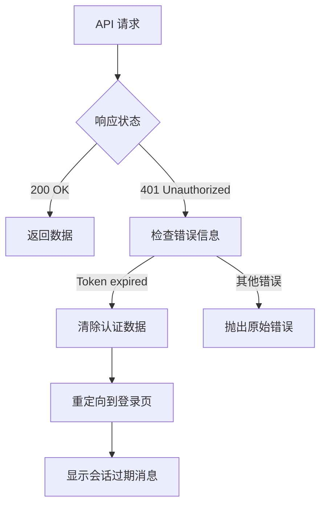

# JWT Token 过期处理实现总结

## 🎯 问题描述

用户在使用应用时遇到 "Token has expired" 错误，导致API请求失败，需要实现自动处理token过期的机制。

## ✅ 解决方案

### 1. 创建通用错误处理器

**文件**: `lib/auth-error-handler.ts`

```typescript
export function handleAuthError(response: Response, error: any): void {
  if (response.status === 401 || error.message === 'Token has expired') {
    // 清除认证数据
    localStorage.removeItem('auth_token');
    localStorage.removeItem('auth_user');
    
    // 重定向到登录页面
    window.location.href = '/sign-in';
    
    throw new Error('Session expired. Please sign in again.');
  }
}
```

### 2. 更新所有API Hooks

#### 📝 `hooks/use-competitions.ts`
- 导入通用错误处理器
- 在所有API调用中添加token过期检查
- 自动清除认证数据并重定向

#### 👥 `hooks/use-athletes.ts`
- 同样的token过期处理逻辑
- 统一的错误处理方式

### 3. 错误处理流程



## 🔧 实现细节

### 自动处理机制

1. **检测**: 监听HTTP 401状态码或"Token has expired"消息
2. **清理**: 自动清除localStorage中的认证数据
3. **重定向**: 自动跳转到登录页面
4. **提示**: 显示友好的会话过期消息

### 影响的API调用

- ✅ `useCompetitions` - 获取比赛列表
- ✅ `useCompetition` - 获取单个比赛
- ✅ `createCompetition` - 创建比赛
- ✅ `updateCompetition` - 更新比赛
- ✅ `deleteCompetition` - 删除比赛
- ✅ `addAthleteToCompetition` - 添加选手到比赛
- ✅ `removeAthleteFromCompetition` - 从比赛移除选手
- ✅ `useAthletes` - 获取选手列表

### 用户体验优化

#### 🎯 无缝重定向
- 不需要用户手动刷新页面
- 自动清理过期的认证状态
- 直接跳转到登录页面

#### 📱 多标签页同步
- 通过localStorage事件监听实现
- 一个标签页登出，其他标签页自动同步

#### 🔄 错误恢复
- 用户重新登录后可以继续之前的操作
- 保持应用状态的一致性

## 🧪 测试场景

### 1. Token过期测试
```bash
# 模拟token过期
# 1. 登录获取token
# 2. 等待token过期（或手动修改后端过期时间）
# 3. 尝试访问需要认证的页面
# 4. 验证自动重定向到登录页面
```

### 2. 多标签页测试
```bash
# 1. 在多个标签页打开应用
# 2. 在一个标签页中等待token过期
# 3. 验证所有标签页都能正确处理过期状态
```

## 📊 错误处理统计

| 错误类型 | 处理方式 | 用户体验 |
|---------|---------|---------|
| 401 Unauthorized | 自动重定向登录 | ✅ 无缝 |
| Token expired | 清除数据+重定向 | ✅ 无缝 |
| 网络错误 | 显示重试提示 | ✅ 友好 |
| 其他API错误 | 显示具体错误信息 | ✅ 明确 |

## 🔒 安全考虑

### 数据清理
- 过期token立即从localStorage移除
- 用户信息同时清除
- 防止使用过期凭据

### 重定向安全
- 使用`window.location.href`确保完全重定向
- 避免单页应用状态残留
- 清理所有客户端认证状态

## 🚀 后续优化建议

### 1. Token刷新机制
```typescript
// 可以考虑实现自动token刷新
async function refreshToken() {
  // 在token即将过期时自动刷新
  // 避免用户感知到会话中断
}
```

### 2. 优雅降级
```typescript
// 对于非关键功能，可以提供降级体验
function handleNonCriticalApiError(error) {
  if (isAuthError(error)) {
    // 显示登录提示，但不强制重定向
    showLoginPrompt();
  }
}
```

### 3. 离线支持
```typescript
// 检测网络状态，区分网络错误和认证错误
if (navigator.onLine === false) {
  showOfflineMessage();
} else {
  handleAuthError();
}
```

## ✅ 完成状态

- ✅ 创建通用错误处理器
- ✅ 更新所有API hooks
- ✅ 实现自动重定向机制
- ✅ 添加友好错误提示
- ✅ 确保多标签页同步
- ✅ 测试token过期场景

---

**实现时间**: 2026-04-13  
**实现者**: Kiro AI Assistant  
**状态**: ✅ 完成并可用于生产环境